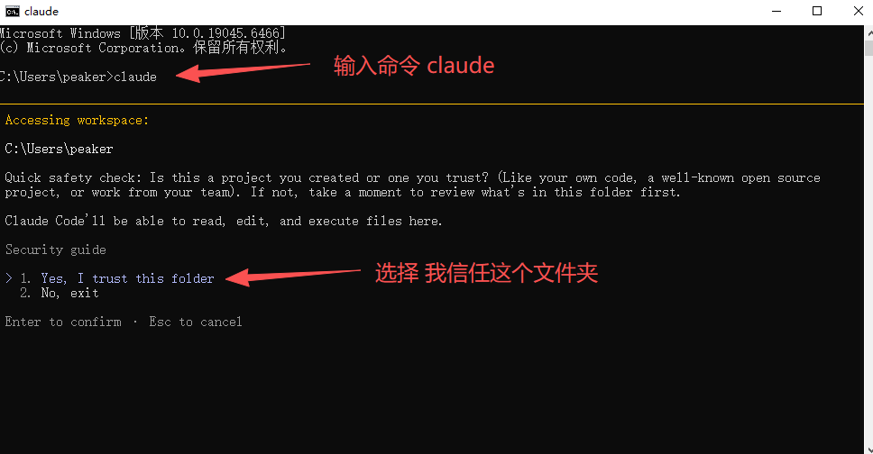
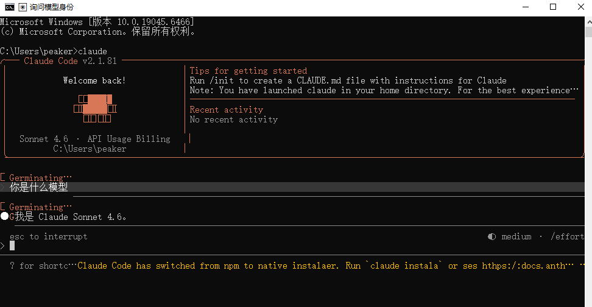

# Claude Code 接入教程

Claude Code 是编程工具，Claude 桌面应用是另一种使用入口。本篇先完成命令行接入，不把桌面功能、扩展和 CLI 拆成重复产品，也不承诺它们自动共享所有配置。

::: tip 使用管理工具
不想手动配置可先看 [管理工具说明](/guide/manager)。
:::

## 1. 安装并确认版本

按 [官方安装说明](https://code.claude.com/docs/en/setup)选择原生安装、WinGet 或 Homebrew 等受支持的方式。安装途径并非都需要 Node.js；不要将 npm 当成唯一方法。


第一种办法:

```powershell
# Windows 已安装 WinGet 时
winget install Anthropic.ClaudeCode
```

第二种办法:

```bash
# macOS 已安装 Homebrew 时
brew install --cask claude-code
```

第三种办法:

安装 Node.js + npm  (已安装用户请忽略)

1\.下载 Node\.js

打开官网：[nodejs下载页](https://nodejs.org/zh-cn/download) 下载 LTS 长期支持版（左边那个，最稳定）。


| Mac · Apple 芯片 | Mac · Intel 芯片 |
| --- | --- |
|  |  |

安装

一路 下一步 / 继续 即可，默认配置不用改。

2\.验证是否安装成功

打开 命令行工具：

- Windows：CMD、PowerShell

- Mac/Linux：终端

输入下面两条命令检查：

```PowerShell
node -v   # 查看 Node.js 版本
npm -v    # 查看 npm 版本
```

出现版本号就是安装成功了


可能出现的问题


处理办法:管理员运行PowerShell

```PowerShell
Set-ExecutionPolicy RemoteSigned -Scope CurrentUser
```

然后重启终端,再次查看


只要出现版本号，就说明**安装成功** ✅。

安装claude

```PowerShell
npm install -g @anthropic-ai/claude-code
```


注意:有些mac用户用上面的命令安装 Claude Code 失败,可能是需要sudo权限

对应的安装命令
```PowerShell
sudo npm install -g @anthropic-ai/claude-code
```
此时要输入你的电脑登录密码,命令行输入是看不到密码的,直接输入敲回车就行了!

最后查看一下版本号

```PowerShell
claude --version
```

如果出现claude版本号就说明安装成功了

## 2. 备份用户配置

先退出 Claude Code。Windows 用 Win+R 打开 `%USERPROFILE%\.claude\settings.json`；

macOS / Linux 对应 `~/.claude/settings.json`；macOS 可在文件创建后运行 `open ~/.claude/settings.json` 打开。没有文件就新建；已有文件先备份。

所需要的配置文件有一个  `settings.json`

没有这个文件就新建,windows直接新建就好.

macOS / Linux 端创建文件命令

先创建并进入对应目录
```bash
mkdir -p ~/.claude && cd ~/.claude
```
创建 `settings.json`
```bash
touch settings.json
```


只合并需要的字段，不覆盖原有权限、插件或项目设置。公司托管设置可能有更高优先级，遇到组织限制时联系管理员。

## 3. 添加本站接入信息

以下是独立的最小示例。把占位文字替换为 [本站](%%SITE_URL%%)创建的%%KEY_WORD%%，不要把示例内容提交到公开仓库：

```json
{
  "env": {
    "ANTHROPIC_BASE_URL": "%%BASE_URL%%",
    "ANTHROPIC_AUTH_TOKEN": "你创建的 API KEY"
  }
}
```


本例不设置绕过权限确认，不关闭危险操作提示。先保持客户端默认确认机制，再讨论进阶自动执行需求。

## 4. 选择模型并启动

从 [本站模型页面](%%MODELS_URL%%)确认精确模型 ID 和分组。使用当前版本提供的模型选择功能；必要时按官方设置说明添加 `model`，不照抄旧截图的别名和上下文参数。

```PowerShell
claude
```
cli终端




先用虚构内容做小文本测试，再按 [首次调用验证](/guide/verify)核对控制台记录。只有文本成功，不能据此声称所有工具调用和上下文长度都通过。

## 5. 常见问题

认证失败先检查实际读取的配置、旧环境变量与密钥状态。路径错误检查基址是否重复追加 `/v1/messages`。收到分组或客户端限制时，使用本站允许的工具与渠道，不伪造客户端身份。

桌面或 IDE 中的功能，请对照它们自己的认证说明；CLI 成功不等于其他环境自动成功。日志先脱敏再交给 [客服](/contact)。

[排错顺序](/guide/troubleshooting) · [备份与恢复](/guide/recovery)

## 参考与验证状态

配置字段依据 [Claude Code settings](https://code.claude.com/docs/en/settings)和 [LLM gateway](https://code.claude.com/docs/en/llm-gateway)。
