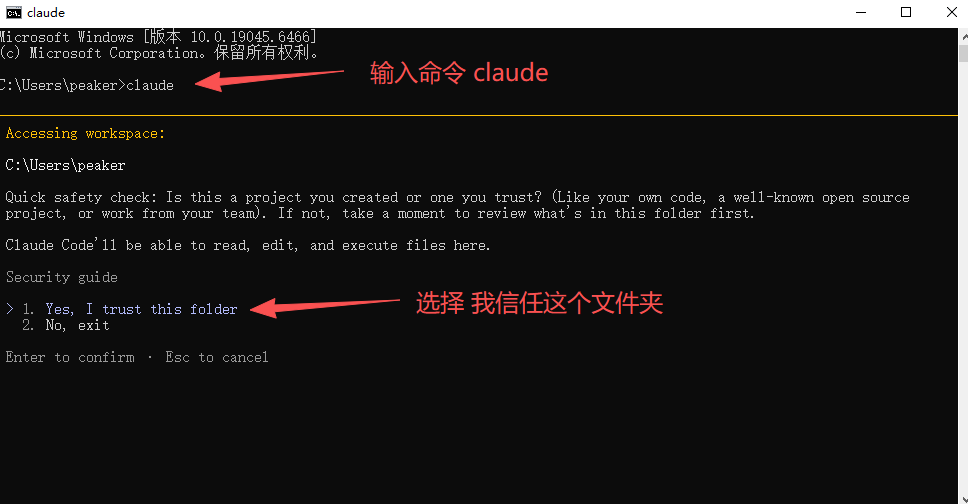
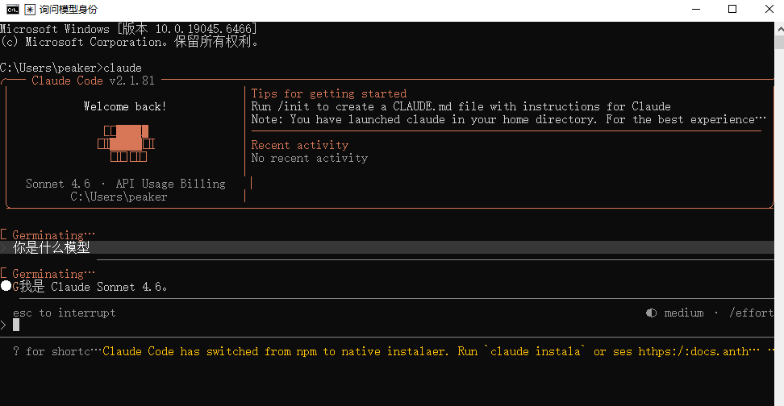

# Claude Code 接入教程

本篇的终点是：Claude Code 能回复第一条消息，且本站能查到对应调用记录。先选一种安装与配置路线，完成后都回到本页验证。想用带窗口的 Claude 应用，请先看 [Claude Desktop 安装与账号说明](/clients/claude-desktop)；两个入口的认证要分别确认。

## 1. 选路线，再做准备 {#choose-route}

| 你的情况 | 选择哪条路线 | 完成后去哪里 |
| --- | --- | --- |
| 第一次安装，希望自动检查环境和应用配置 | **推荐：[路线 A：管理工具](#managed-route)** | [在练习目录启动](#start-check) → [验证首次调用](#first-request) |
| 想自己安装、编辑配置文件 | [路线 B：手动安装](#manual-install) → [手动配置](#manual-config) | 同样进入 [首次调用验证](#first-request) |
| 已安装并已配置本站 | 直接从 [练习目录与认证检查](#start-check)开始 | 验收后做 [第一次任务](/learn/claude/first-task) |

1. 按 [注册与账号准备](/guide/account)登录本站，确认可用额度和分组。走手动路线时，再准备一个有效的 [%%KEY_WORD%%](%%KEYS_URL%%)。
2. 从 [本站模型页](%%MODELS_URL%%)复制当前分组支持的 Claude 模型 ID。后面的占位文字必须替换，不能照抄旧截图里的模型名。
3. 确认自己的系统：Windows 使用普通 PowerShell，macOS 使用“终端”。后面只执行自己系统对应的命令。

**认证方式先选清楚：** 本篇使用本站密钥和 `%%BASE_URL%%`。Anthropic 官方账号登录、官方订阅和本站账号分别管理；登录官方账号不代表接入星芒。已有官方登录可以保留，后面用 `/status` 确认本次实际使用的基址和认证来源。

**完成标志：** 知道自己选 A 还是 B，本站账号和模型已准备好。缺账号或额度时先完成 [账号准备](/guide/account)，不用先尝试安装命令。

## 2. 路线 A：用管理工具自动接入 {#managed-route}

1. 打开 [星芒管理工具教程](/guide/manager)，从 [本站安装包下载区](/guide/manager#download-installers)选适合系统的管理工具，完成安装并打开。
2. 按管理工具的引导完成本站账号或接入方式确认，选择 **Claude Code**，让工具检查环境并执行安装。确认安装对象是 Claude Code，而不是 Claude Desktop。
3. 核对本站地址、账号和配置写入位置。已有配置先按引导备份，再应用本站配置；当前版本没有对应功能时，改走 [手动路线](#manual-install)。
4. 使用管理工具提供的 Claude Code 启动入口。安装或配置报错时先处理当前错误，不直接跳过。

**完成标志：** 管理工具中 Claude Code 显示已安装，应用配置没有错误，并能打开目标工具。接下来直接去 [第 5 步：练习目录与认证检查](#start-check)，**不用再执行路线 B 的安装和配置**。

**卡住时：** 下载或安装问题回 [管理工具教程](/guide/manager)核对；认证问题看 [连接排错](/guide/troubleshooting)。切换手动路线前先保留已有配置备份。

## 3. 路线 B：按系统手动安装 {#manual-install}

先在下表选一项，只做这一项。按 [官方安装说明](https://code.claude.com/docs/en/setup)确认系统要求。

| 系统与已有工具 | 本页入口 |
| --- | --- |
| Windows，已有 WinGet | [Windows 安装](#windows-install) |
| macOS，已有 Homebrew | [macOS 安装](#mac-install) |
| 没有上述包管理器，或使用 Linux | 官方安装页的 **Native Install**，选择对应系统命令 |
| 已经使用 Node.js/npm，希望沿用它 | 展开下面的“备选：npm 安装” |

WinGet、Homebrew 和原生安装不需要先安装 Node.js。没有 WinGet/Homebrew 时无需为了本教程再安装它们，可选官方原生安装。PowerShell、CMD 和 macOS/Linux 命令不能混用。

### Windows：已有 WinGet {#windows-install}

1. 从开始菜单打开普通 **PowerShell**。
2. 粘贴下面这一条命令，按回车，等待安装结束。

**运行环境：Windows PowerShell。**

```powershell
winget install Anthropic.ClaudeCode
```

安装结束后跳到 [检查版本](#check-version)，不必执行 macOS 或 npm 步骤。

### macOS：已有 Homebrew {#mac-install}

1. 打开 Mac 的 **终端**。
2. 粘贴下面这一条命令，按回车，等待安装结束。

**运行环境：macOS 终端，已安装 Homebrew。**

```bash
brew install --cask claude-code
```

安装结束后跳到 [检查版本](#check-version)，不必执行 npm 步骤。

<details>
<summary>备选：npm 安装（只有选择这条路线才展开）</summary>

只有选这条路径才需要 Node.js。打开 [Node.js 下载页](https://nodejs.org/zh-cn/download)，选择适合系统与芯片的 LTS 安装程序；已安装时先检查版本，Claude 当前 npm 安装要求 Node.js 22 或以上。


| Mac · Apple 芯片 | Mac · Intel 芯片 |
| --- | --- |
|  |  |

截图用于识别系统和芯片选项，实际按钮位置与版本以官网为准。

1. 安装或检查 Node.js，确认版本符合要求。
2. 重新打开终端，依次检查 Node.js/npm 版本，再安装 Claude Code。

**运行环境：Windows PowerShell、macOS/Linux 终端，已安装 Node.js。**

```text
node -v
npm -v
npm install -g @anthropic-ai/claude-code
```


如果出现图中这类“无法加载 npm.ps1，因为禁止运行脚本”的错误，在普通 PowerShell 使用 `npm.cmd -v` 和 `npm.cmd install -g @anthropic-ai/claude-code`。这能避开 PowerShell 脚本入口，无需为安装修改执行策略。公司管理的设备遵守管理员的安装限制。

macOS/Linux 遇到 `EACCES` 或权限错误时，停止 npm 安装，改用官方原生安装或按官方排错说明修复用户安装目录；**不要给 npm 安装命令加 `sudo`**。

</details>

### 检查版本 {#check-version}

1. 安装结束后重新打开终端。
2. 运行下面命令，确认显示的是 Claude Code 版本。

**运行环境：Windows PowerShell 或 macOS/Linux 终端。**

```text
claude --version
```

**完成标志：** 显示 Claude Code 版本号，继续 [第 4 步：手动配置](#manual-config)。若提示“找不到命令”，先重开终端，再按官方安装页排查 PATH；不要继续填写配置或反复安装不同版本。

## 4. 路线 B：备份并填写本站配置 {#manual-config}

这一步仅供手动路线。管理工具已成功应用配置的用户，直接去 [第 5 步](#start-check)。

1. 退出正在运行的 Claude Code。
2. 找到用户配置文件：Windows 为 `%USERPROFILE%\.claude\settings.json`，macOS/Linux 为 `~/.claude/settings.json`。设置过 `CLAUDE_CONFIG_DIR` 时使用实际目录。
3. 已有文件先备份；没有文件再按自己系统的步骤创建。安装 CLI 不一定会创建这个文件。

**已有文件：** 先复制一份，例如保存为 `settings.before-xingmang.json`。后面只合并接入字段，保留已有权限、插件和其他设置。

**运行环境：Windows 普通 PowerShell；仅在默认用户目录创建或打开配置。**

```powershell
New-Item -ItemType Directory -Force -Path "$env:USERPROFILE\.claude"
notepad "$env:USERPROFILE\.claude\settings.json"
```

记事本询问是否创建时选择创建。填入下一节内容后保存；若出现“另存为”，文件类型选择“所有文件”，名称为 `settings.json`，编码用 UTF-8。打开资源管理器的“文件扩展名”显示，确认没有保存成 `settings.json.txt`。

**运行环境：macOS/Linux 终端；没有配置文件时执行。**

```bash
mkdir -p ~/.claude
touch ~/.claude/settings.json
```

macOS 可用 `open -e ~/.claude/settings.json` 打开文本编辑；Linux 用自己的文本编辑器打开该文件。保存纯文本 JSON，不使用富文本格式。

### 合并接入字段

1. 新建空文件时填入下面完整示例；已有文件只合并 `env` 中的两个接入字段。
2. 把密钥占位文字替换成本站创建的密钥，核对基址后保存。

**填写位置：`settings.json` 文件内容，不是在终端执行。**

```json
{
  "env": {
    "ANTHROPIC_BASE_URL": "%%BASE_URL%%",
    "ANTHROPIC_AUTH_TOKEN": "替换为你在本站创建的密钥"
  }
}
```

已有 `env` 时只新增或更新这两个字段，不再创建第二个 `env`，也不要用整个示例覆盖文件。JSON 字段之间用逗号分隔，最后一个字段后不加逗号。

保存后关闭编辑器。基址按示例填写，**不要追加 `/v1/messages`**；密钥文件留在用户配置目录，不放进练习项目或公开仓库。保持 Claude 默认的操作确认机制。

**完成标志：** 文件名为 `settings.json`，占位密钥已替换，旧设置保留，已有文件也已备份。继续 [第 5 步](#start-check)。保存失败或不知道字段如何合并时，先停在这里，按 [备份与恢复](/guide/recovery)检查，或改用 [管理工具路线](#managed-route)。

## 5. 两条路线汇合：在练习文件夹启动 {#start-check}

1. 准备空白练习文件夹。若 `XingmangPractice` 已存在且含其他内容，另选新名称，并把下面命令中的目录名一起替换。
2. 在能够运行 `claude` 的终端中执行自己系统对应的命令。通过管理工具安装时优先使用它提供的启动或终端入口；普通终端找不到命令时回管理工具检查，不再重复 npm 安装。
3. 将模型占位文字换成准备步骤中从本站复制的模型 ID，再启动 Claude。

**运行环境：Windows PowerShell。**

```powershell
New-Item -ItemType Directory -Force -Path "$env:USERPROFILE\XingmangPractice"
Set-Location "$env:USERPROFILE\XingmangPractice"
claude --model "替换为本站可用的模型ID"
```

**运行环境：macOS/Linux 终端。**

```bash
mkdir -p ~/XingmangPractice
cd ~/XingmangPractice
claude --model "替换为本站可用的模型ID"
```

第一次启动可能需要选主题和确认工作区。先看提示中的完整路径，只有它确实是你创建的 `XingmangPractice` 时才信任；如果显示用户根目录或陌生目录，退出，进入练习目录后重开。



**旧截图提醒：图中的 `C:\Users\peaker` 是用户目录，不能照图信任整个用户目录。** 本教程应显示你自己的 `XingmangPractice`。截图中的用户名、版本和模型均不作为配置值。



**输入位置：Claude Code 的对话输入框。** 先运行 `/status`，检查 `Anthropic base URL` 指向 `%%BASE_URL%%`，认证来源显示本站密钥对应的 Auth token 或 API key。不同配置方式可能使用不同的凭据字段，以实际来源为准。

**完成标志：** 工作区是练习目录，基址和认证来源正确。继续 [第 6 步](#first-request)。若仍要求登录官方账号，回 [手动配置](#manual-config)或 [管理工具路线](#managed-route)检查，不把本站密钥填入官方网页登录表单。

## 6. 发送第一条消息并验收 {#first-request}

1. 在 Claude Code 对话输入框粘贴下面测试语句并按回车。
2. 收到回复后，打开本站调用记录，按下面三项验收。

**输入位置：Claude Code 对话输入框，不是在 PowerShell 或终端提示符后运行。**

```text
请只回复“连接测试成功”，不要读取文件或运行命令。
```

本次接入成功需要同时看到：

1. Claude 返回文本，没有认证或模型错误。
2. `/status` 中的基址、认证来源和所选模型符合预期。
3. 按 [首次调用验证](/guide/verify)，在本站找到对应时间、密钥和模型的调用记录。

模型回复自己“是谁”不能证明实际路由。文本验收后做 [Claude 第一次任务](/learn/claude/first-task)，使用现成材料逐项验证读取和修改能力；文本成功不代表所有工具或上下文长度都通过。

## 7. 失败时下一步 {#troubleshooting}

| 现象 | 下一步 |
| --- | --- |
| 找不到 `claude` | 管理工具路线回 [工具入口](#managed-route)；手动路线回 [检查版本](#check-version) |
| 配置错误或仍进入官方登录 | 回 [配置步骤](#manual-config)核对用户目录、文件后缀和 JSON；可在系统终端运行 `claude doctor` 检查配置错误 |
| 401 / 密钥无效 | 核对密钥完整性和状态，以及 `/status` 显示的认证来源；不要公开密钥 |
| 404 / 路径错误 | 核对基址，去掉误加的请求路径，再检查模型 ID |
| 模型、分组、额度或客户端限制 | 回本站确认密钥所属分组与可用模型；按允许的工具使用，不伪造客户端身份 |
| 有回复但本站无记录 | 先停止项目任务，检查是否仍使用官方登录或其他配置；按验证页核对记录筛选条件 |

需要撤销时先退出 Claude，把备份文件恢复到原路径；本来没有配置文件的用户只移除本次新增的接入字段。重新启动并检查 `/status`，确认恢复结果。其他问题按 [排错顺序](/guide/troubleshooting)和 [备份与恢复](/guide/recovery)处理，提供脱敏信息给 [客服](/contact)。

## 官方参考

参考 [官方安装说明](https://code.claude.com/docs/en/setup)、[settings](https://code.claude.com/docs/en/settings)和 [网关接入说明](https://code.claude.com/docs/en/llm-gateway-connect)，核对日期：2026-10-04。实际可用模型与功能取决于客户端版本和本站分组，请按本篇的小请求与调用记录验证当前渠道。
