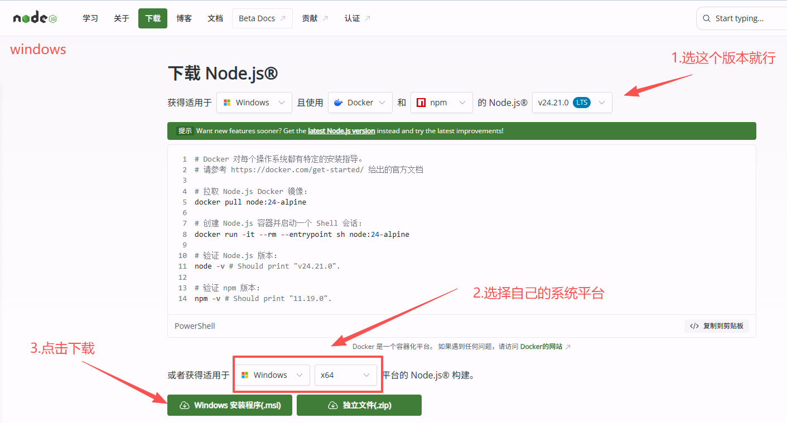
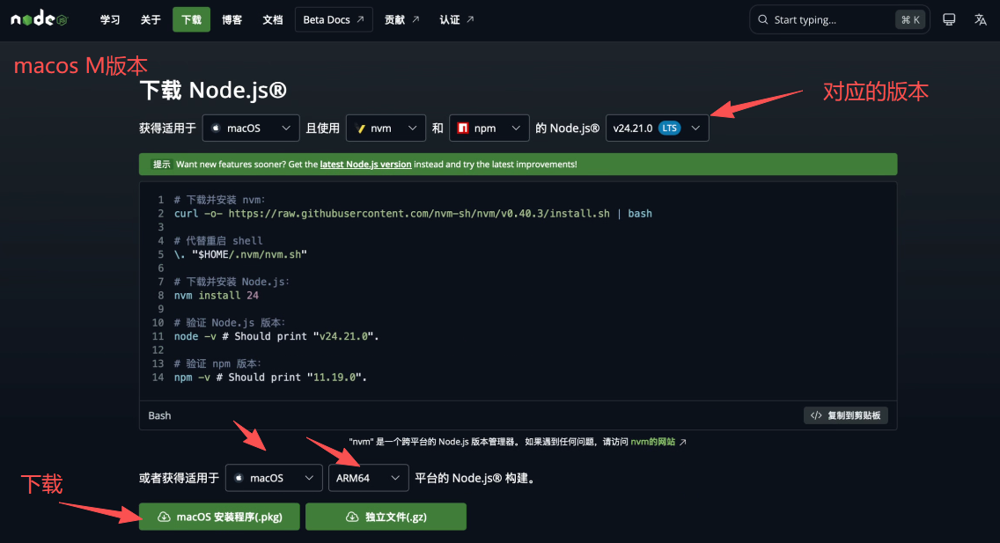
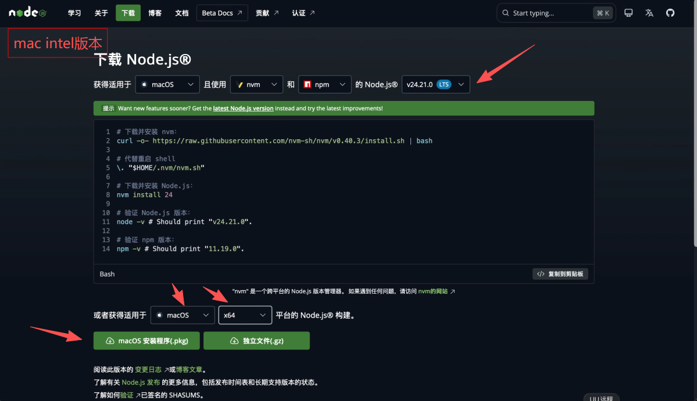
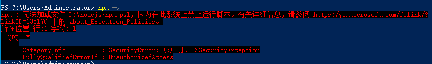
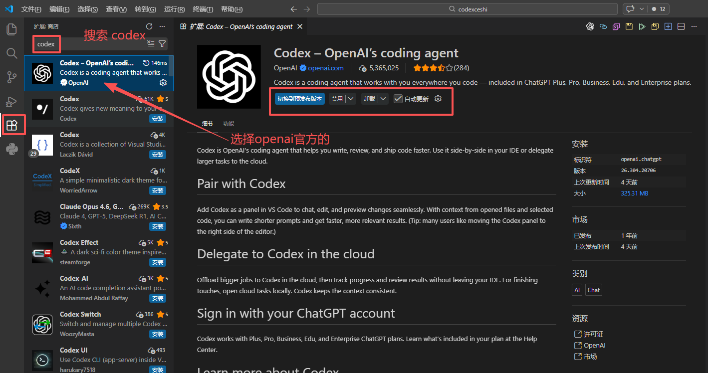
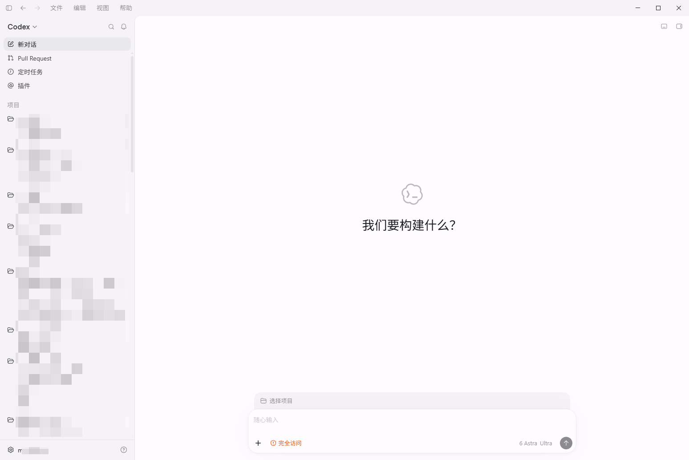
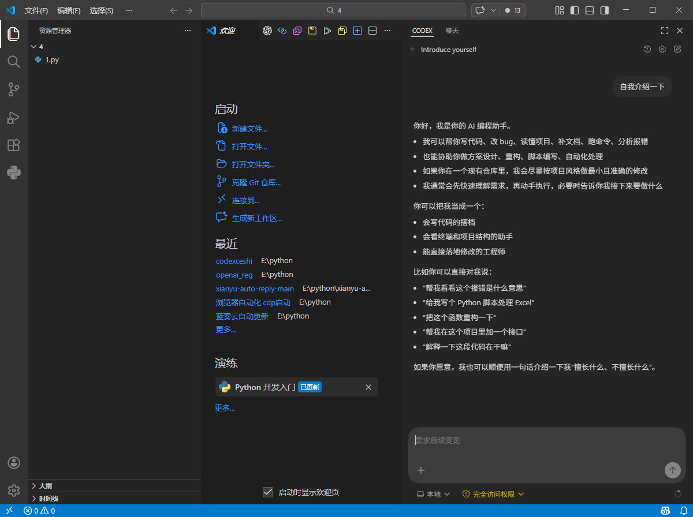
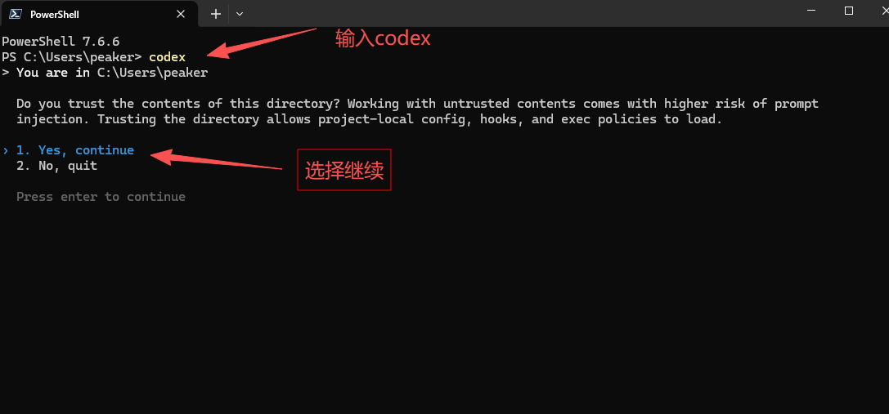
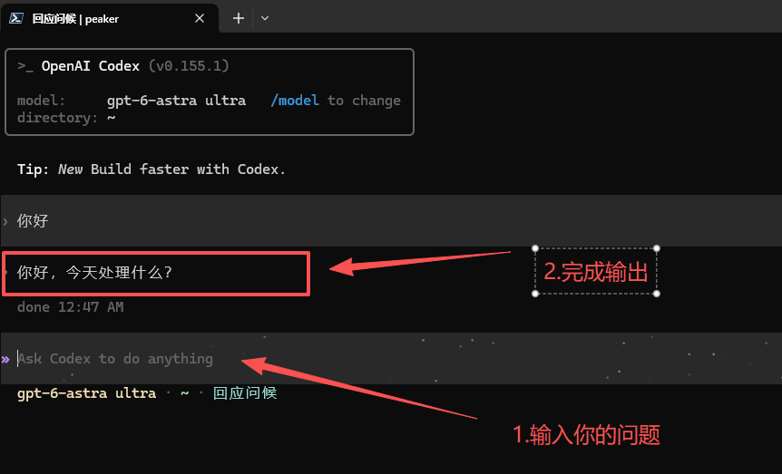

# OpenAI / Codex 接入教程

本篇先讲 Codex CLI 的本站接入。桌面应用、IDE 扩展与命令行是不同使用入口，具体名称和功能以安装版本的官方说明为准；不能把某一入口配置成功当作所有入口都已适配。

[想先了解怎么使用？阅读 Codex 零基础](/learn/codex/)；

不想手动配置可先看 [管理工具说明](/guide/manager)。

## 1. 安装与准备

根据 [官方 CLI 安装说明](https://developers.openai.com/codex/cli/)。采用 npm 方式时，先完成Node.js 准备

### 1.1 安装 Node.js + npm  (已安装用户请忽略)

1\.下载 Node\.js

打开官网：[nodejs下载页](https://nodejs.org/zh-cn/download) 下载 LTS 长期支持版（左边那个，最稳定）。




| Mac · Apple 芯片 | Mac · Intel 芯片 |
| --- | --- |
|  |  |

安装

一路 下一步 / 继续 即可，默认配置不用改。

2\.验证是否安装成功

打开 命令行工具：

- Windows：CMD、PowerShell

- Mac/Linux：终端

输入下面两条命令检查：

```PowerShell
node -v   # 查看 Node.js 版本
npm -v    # 查看 npm 版本
```

出现版本号就是安装成功了


可能出现的问题





处理办法:管理员运行PowerShell

```PowerShell
Set-ExecutionPolicy RemoteSigned -Scope CurrentUser
```

然后重启终端,再次查看


只要出现版本号，就说明**安装成功** ✅。

### 1.2 安装 codex cli (已安装的用户请忽略)

```PowerShell
npm install -g @openai/codex
```

```PowerShell
codex --version
```
只要出现版本号，就说明**安装成功** ✅。

注意:有些mac用户用上面的命令安装codex cli 失败,可能是需要sudo权限

对应的安装命令

```PowerShell
sudo npm install -g @openai/codex
```
此时要输入你的电脑登录密码,命令行输入是看不到密码的,直接输入敲回车就行了!


## ide界面（vscode、cursor、windsurf、kiro）安装codex扩展 (可选安装)

注意：不是用编辑器的，可以略过这一步



其他ide界面同理

## 2. 备份并改两个文件

先退出正在运行的 Codex。

Windows 用 Win+R 打开 `%USERPROFILE%\.codex`；macOS / Linux 对应目录是 `~/.codex`。macOS 可在目录创建后运行 `open ~/.codex` 打开文件夹。

所需要的配置文件有两个  `auth.json` 和 `config.toml`

没有这两个文件就新建,windows直接新建就好.

macOS / Linux 端创建文件命令

先创建并进入对应目录
```bash
mkdir -p ~/.codex && cd ~/.codex
```
创建 `auth.json`
```bash
touch auth.json
```
创建 `config.toml`
```bash
touch config.toml
```

已有文件先备份，只改必要字段。

`auth.json` 只放这一项，不要写别的：

```json
{
  "OPENAI_API_KEY": "换成你从网站获取的%%KEY_WORD%%"
}
```

`config.toml` 可先按下面这份示例改。模型名以 [本站列表](%%MODELS_URL%%)为准，分组里没有的不要硬填：

```toml
model_provider = "XingmangAI"
model = "gpt-6-astra"
review_model = "gpt-6-astra"

model_reasoning_effort = "high"
approval_policy = "on-request"
sandbox_mode = "workspace-write"

disable_response_storage = true
network_access = "enabled"
windows_wsl_setup_acknowledged = true


[model_providers.XingmangAI]
name = "XingmangAI"
base_url = "%%CODEX_BASE_URL%%"
wire_api = "responses"
requires_openai_auth = true

[features]
goals = true
```

::: warning 先确认基址
本站 Codex 填 `%%CODEX_BASE_URL%%`。不要把 `/responses` 写进基址。两个文件都要改，只改其中一个常会认证失败。
:::

## 3. 重启后再验证

改完后重启 Codex 桌面端、IDE 扩展或终端里的 CLI，再按 [验证第一次调用](/guide/verify)做一次小文本测试，并到本站记录里核对。

codex桌面端


vscode


cli终端


认证失败先看 `auth.json` 是否完整、%%KEY_WORD%%是否启用。路径错误先看 `base_url` 是不是 `%%CODEX_BASE_URL%%`。模型不允许时检查分组和精确 ID。

## 4. 连接之后怎么用

从 [第一次任务](/learn/first-task)开始练习提需求，再学习 [文件夹操作](/learn/working-with-files)和 [结果检查](/learn/review-and-revise)。需要完整学习路线时进入 [Codex 零基础](/learn/codex/)。
