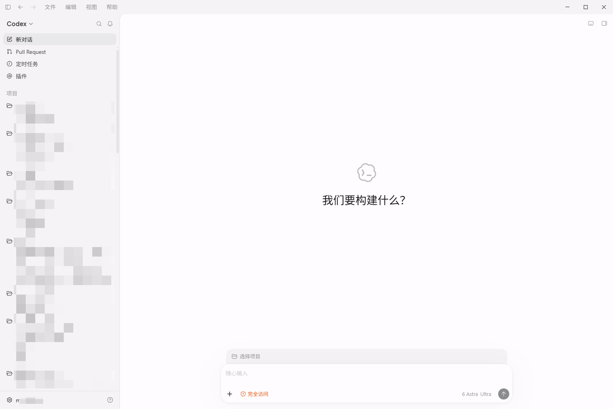
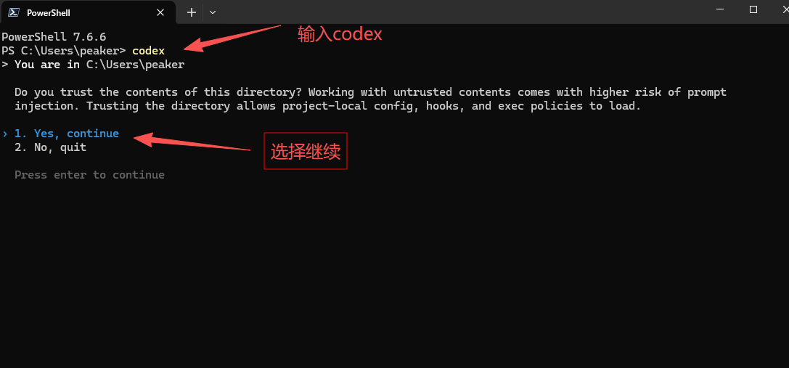
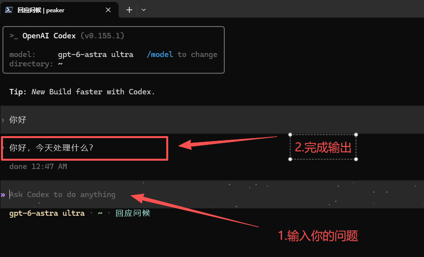

# OpenAI / Codex 接入教程

<a id="route-choice"></a>

**本页目标：** 用你选择的 Codex 入口发送一条文本，并在本站找到对应调用记录。第一次只选一条路线，不必把所有入口装齐。

| 你准备怎么用 | 按顺序走 | 已安装时从这里继续 |
| --- | --- | --- |
| **桌面应用**：在窗口里使用 | [安装桌面应用](#desktop-install) → [配置本站](#site-config) → [启动桌面应用](#desktop-start) → [核对调用](#verify-call) | [配置本站](#site-config)，无需先装 Node.js 或 CLI |
| **CLI**：在终端里使用 | [安装 CLI](#cli-install) → [配置本站](#site-config) → [启动 CLI](#cli-start) → [核对调用](#verify-call) | [配置本站](#site-config) |
| **IDE 扩展**：已有支持的编辑器 | [安装扩展](#ide-install) → [配置本站](#site-config) → [启动扩展](#ide-start) → [核对调用](#verify-call) | [核对配置位置](#site-config) |

**开始前准备：** 完成 [注册与准备](/guide/account)，准备本站%%KEY_WORD%%及所属分组允许的 [模型 ID](%%MODELS_URL%%)。官方 ChatGPT 账号和本站 API 接入分别使用各自认证与额度；安装成功不会自动接入本站。

希望由管理工具协助安装和配置，进入 [星芒管理工具教程](/guide/manager)。已经接通则跳到 [第一次任务](/learn/first-task)，或 [返回 Codex 学习路线](/learn/codex/)自主选课。

## 1A. CLI 路线：安装命令行 {#cli-install}

本节只给终端用户使用，按 [官方 CLI 安装说明](https://developers.openai.com/codex/cli/)的 npm 方式安装。桌面用户直接去 [桌面安装](#desktop-install)。

### 安装 Node.js（已有可用版本可跳过） {#node-install}

1. 打开 [Node.js 下载页](https://nodejs.org/zh-cn/download)，选择当前受支持的 LTS 版本，核对操作系统和芯片架构。不要根据旧截图中按钮的位置选择版本。


| Mac · Apple 芯片 | Mac · Intel 芯片 |
| --- | --- |
|  |  |

2. 完成安装后重新打开终端：Windows 使用普通 PowerShell；macOS / Linux 使用终端。已有版本管理器时，继续按它的方式安装，不重复覆盖系统环境。
3. 在终端逐行输入下面两条命令检查。

```PowerShell
node -v   # 查看 Node.js 版本
npm -v    # 查看 npm 版本
```

两条命令都显示版本号，才继续安装 CLI；这一步尚未验证模型连接。找不到命令时按 [Node.js 与终端准备](/clients/nodejs)排查。

**Windows 脚本策略报错时：**


如果报错明确提到 `npm.ps1` 无法运行，在同一个普通 PowerShell 中改用：

```PowerShell
npm.cmd --version
```

后面的安装命令也可用 `npm.cmd` 代替 `npm`。这不需要管理员终端或更改执行策略；其他错误不要套用此方法。


确认 `node` 和 `npm` 都可用后，再继续下一步。

### 安装并检查 CLI {#install-cli-command}

1. 在刚才的终端安装 Codex CLI；已经安装时直接检查版本。

```PowerShell
npm install -g @openai/codex
```

2. 运行版本命令。

```PowerShell
codex --version
```
能显示版本号表示 CLI 已可启动，接下来还要配置本站并发送测试请求。

Windows 若 `codex.ps1` 被策略阻止，使用 `codex.cmd --version`，后续也可用 `codex.cmd` 启动。macOS / Linux 遇到 `EACCES` 时，按 [npm 官方权限排错](https://docs.npmjs.com/resolving-eacces-permissions-errors-when-installing-packages-globally)检查用户级安装或版本管理器，不直接给安装命令添加 `sudo`。


**本节完成标志：** 能看到 Codex 版本号。下一步直接去 [配置本站](#site-config)，无需安装下方桌面应用或扩展。

## 1B. 桌面路线：安装应用 {#desktop-install}

这条路线不要求先装 Node.js 或 CLI。从 [本站安装包入口](/guide/manager#download-installers)或 [官方桌面说明](https://developers.openai.com/codex/app/)选择与你系统匹配的版本。

### Windows

1. 查看“设置 → 系统 → 关于”中的系统类型，在下载区选 Windows x64 或 ARM64 对应条目。
2. 展开该条目的“安装说明与校验”，按当前安装包格式操作。若需要许可文件，安装包与许可文件必须同版本、同架构；不要仅下载其中一个。
3. 安装结束，从开始菜单打开应用，确认能出现欢迎或主界面，然后退出应用，继续 [配置本站](#site-config)。

### macOS

1. 在“关于本机”查看芯片，选择下载区实际提供且匹配设备的包。
2. 按条目说明解压或打开安装包，将应用放入“应用程序”，再从那里启动。
3. 确认能出现欢迎或主界面，退出应用，继续 [配置本站](#site-config)。

**本节完成标志：** 应用能独立打开。界面名称可能显示 Codex 或 ChatGPT 桌面应用；后续需选择 Codex 工作入口。安装错误先按下载条目的说明核对文件、系统和架构，不以关闭系统保护作为解决办法。

## 1C. 可选路线：安装 IDE 扩展 {#ide-install}

1. 在已有编辑器的扩展市场查找 OpenAI 发布的 Codex 扩展，核对发布者后安装。只有当前官方说明支持的编辑器才照此操作。
2. 打开扩展入口，确认能看到其欢迎页或对话面板；随后退出编辑器，继续 [配置本站](#site-config)。


本机、WSL、容器和远程 IDE 可能使用不同的用户目录。以下示例面向本机默认目录；已设置 `CODEX_HOME` 或企业托管配置的用户先确认实际位置。桌面端、扩展和 CLI 都要各自完成调用验证。

## 2. 配置本站：各路线共用的本机配置 {#site-config}

先退出正在运行的 Codex。以下采用文件存储认证，会切换本机 Codex 的认证来源。已有官方登录或其他提供方配置时，先按 [备份与恢复](/guide/recovery)保存 `config.toml`、`auth.json` 的副本，记录原来的认证存储设置。

本节需要 `auth.json` 和 `config.toml`。只做自己系统对应的分支：[Windows](#config-windows) / [macOS 与 Linux](#config-mac)，然后一起完成 [填入本站配置](#config-values)。

### Windows：打开配置文件 {#config-windows}

1. Windows 用 Win+R 打开 `%USERPROFILE%\.codex`，先备份已有文件；目录不存在时运行下方第一条命令创建。
2. 在普通 PowerShell 中打开两个文件，准备填写下一小节内容。

```powershell
New-Item -ItemType Directory -Force "$env:USERPROFILE\.codex" | Out-Null
notepad "$env:USERPROFILE\.codex\config.toml"
notepad "$env:USERPROFILE\.codex\auth.json"
```

已有文件会直接打开，不要清空整份配置。新建时保存为 UTF-8，开启文件资源管理器的“文件扩展名”，确认文件没有被保存为 `config.toml.txt` 或 `auth.json.txt`。

### macOS / Linux：打开配置文件 {#config-mac}

1. 默认目录为 `~/.codex`。先备份已有文件；目录不存在时创建并进入。
```bash
mkdir -p ~/.codex && cd ~/.codex
```
2. 创建需要的文件。`touch` 不会清空已有内容。
```bash
touch auth.json
```
```bash
touch config.toml
```

3. macOS 用 `open -e ~/.codex/config.toml` 和 `open -e ~/.codex/auth.json` 编辑；Linux 使用本机文本编辑器。

### 填入本站配置 {#config-values}

已有文件先备份，只改必要字段。TOML 的顶层字段放在第一个 `[表名]` 之前，同一表不要重复定义。

`auth.json`：备份旧认证内容后，将本次使用的本站%%KEY_WORD%%填入下方 API Key 认证示例。不要把旧的 ChatGPT 登录令牌拼进此示例，也不要把提示文字当作真实密钥。

```json
{
  "OPENAI_API_KEY": "换成你从网站获取的%%KEY_WORD%%"
}
```

`config.toml` 使用以下最小配置。把 `REPLACE_WITH_MODEL_ID` 替换为 [本站列表](%%MODELS_URL%%)中当前分组允许的精确模型 ID；已有文件只合并需要的字段：

```toml
model_provider = "XingmangAI"
model = "REPLACE_WITH_MODEL_ID"
cli_auth_credentials_store = "file"

[model_providers.XingmangAI]
name = "XingmangAI"
base_url = "%%CODEX_BASE_URL%%"
wire_api = "responses"
requires_openai_auth = true
```

`requires_openai_auth` 是 Codex 读取其认证资料的配置字段，不代表这里必须登录 ChatGPT；本例读取刚保存的 API Key。保留客户端默认权限，不需要增加联网放权、实验功能或高推理强度才能连通。

::: warning 先确认基址
本站 Codex 填 `%%CODEX_BASE_URL%%`，不要追加 `/responses`。两个文件都要核对，模型占位符必须替换。JSON 不支持注释或尾随逗号。本站渠道需要兼容 Responses；配置可保存不等于渠道已经验证。
:::

**本节完成标志：** 两文件已保存，模型和密钥占位文字已替换，原配置已有备份。下一步只打开你所选的入口：[CLI](#cli-start) / [桌面应用](#desktop-start) / [IDE 扩展](#ide-start)。

## 3. 按所选入口启动 {#start-client}

### CLI：进入练习目录后启动 {#cli-start}

新建一个空的练习目录，从该目录启动。如果 `codex-practice` 已存在且含有其他内容，换一个新的空目录并相应修改下方路径。Windows PowerShell：

```powershell
New-Item -ItemType Directory -Force "$env:USERPROFILE\codex-practice" | Out-Null
Set-Location "$env:USERPROFILE\codex-practice"
codex
```

macOS / Linux：

```bash
mkdir -p ~/codex-practice
cd ~/codex-practice
codex
```

出现工作目录或信任确认时，先确认显示的是这个练习目录。若仍要求登录、报配置解析错误或直接退出，先看下方排错，不继续选择官方登录来代替本站配置。

**本节完成标志：** 终端进入 Codex 的输入区。接下来去 [第 4 步发送测试](#verify-call)；无需再安装或启动桌面应用。

### 桌面应用：选择 Codex 入口 {#desktop-start}

1. 重新打开已经安装的桌面应用，确认它读取的是刚配置的本机用户环境。
2. 若应用同时提供多种工作入口，选择 Codex；打开一个新对话，保留默认权限。
3. 看到对话输入区后，继续 [第 4 步发送测试](#verify-call)。若仍显示官方账号登录、其他提供方或配置错误，先去 [失败排查](#troubleshooting)，不要通过登录官方账号替代本站配置。

### IDE 扩展：从编辑器打开 {#ide-start}

1. 重新打开编辑器中的 Codex 扩展，确认它运行在已配置的本机环境；远程、容器和 WSL 的配置位置需要另外核对。
2. 打开一个新对话，看到输入区后，继续 [第 4 步发送测试](#verify-call)。

桌面应用、扩展和 CLI 都要各自做一次小测试。官方云任务、插件、图片生成和电脑操作等能力有各自条件，不由本站文本请求成功保证。

## 4. 发送文本并核对本站记录 {#verify-call}

1. 在所选客户端的对话输入区发送下面的文字。CLI 用户不要将它粘到 PowerShell 或系统命令提示符中。

```text
这是连接测试。请用一句话回复“连接测试完成”。
不要联网，不读写文件，不执行其他工具。
```

2. 等收到完整回复，再到 [本站控制台](%%CONSOLE_URL%%)打开调用或用量记录，核对刚才的时间、模型和状态。
3. 两项都确认后再继续练习；只有回复却没有本站记录时，先按 [失败排查](#troubleshooting)核对路由与记录延迟。

**接入完成标志：** 客户端可启动、文本有完整回复、本站有对应记录。详细判断见 [验证第一次调用](/guide/verify)。

codex桌面端


vscode


cli终端


配图用于辨认入口，目录、版本和模型以你本次实际显示为准。

## 失败时从哪里继续 {#troubleshooting}

| 现象 | 下一步 |
| --- | --- |
| 命令找不到或脚本策略错误 | 回到第 1 节，检查 `codex --version` 或 `codex.cmd --version` |
| 配置解析失败 | 检查扩展名、JSON 逗号、TOML 重复表及顶层字段位置 |
| 登录提示或认证失败 | 检查实际 `CODEX_HOME`、文件存储设置及%%KEY_WORD%%状态；`codex login status` 仅用于查看认证方式，不要输出密钥 |
| 模型不存在或不允许 | 重新核对模型 ID、分组与额度，不照抄配图模型 |
| 路径错误或协议不兼容 | 核对 `%%CODEX_BASE_URL%%` 和 Responses 支持，保留脱敏错误，不尝试随机路径 |
| 有回复但本站无记录 | 检查官方登录、旧终端、远程环境及记录延迟，暂不执行批量任务 |

仍未解决时按 [连接排错](/guide/troubleshooting)提供版本、时间与脱敏错误；需要回退时关闭应用，按 [备份恢复](/guide/recovery)恢复本次文件和原认证存储设置。

## 完成后选下一步 {#next}

建议顺序：[第一次文本任务](/learn/first-task) → [文件夹操作](/learn/working-with-files) → [结果检查与修改](/learn/review-and-revise)。已经会其中某项，可以直接点下一项；想先认界面则去 [Codex 零基础](/learn/codex/)。

[返回 Codex 学习路线](/learn/codex/) · [回到路线选择](#route-choice) · [下一课：第一次文本任务](/learn/first-task)

参考：[官方认证](https://developers.openai.com/codex/auth/) · [自定义提供方](https://developers.openai.com/codex/config-advanced/)。2026-10-04 核对官方文档；按上方小任务验证当前版本与本站渠道。
