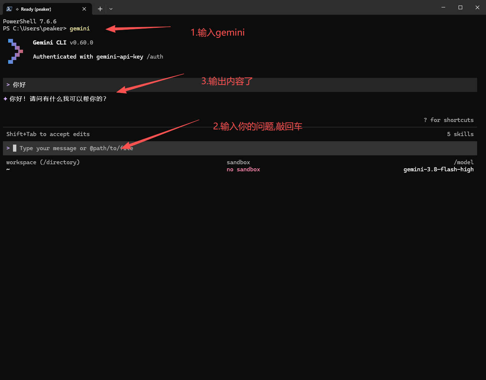

# Gemini CLI 接入教程

本篇对应终端中的 Gemini CLI。Gemini 网页、Google 官方账号登录与本站 API Key 并不是同一条认证路径。

::: tip 使用管理工具
不想手动配置可先看 [管理工具说明](/guide/manager)。
:::


## 1. 安装与准备

### 1.1 安装 Node.js + npm  (已安装用户请忽略)

1\.下载 Node\.js

打开官网：[nodejs下载页](https://nodejs.org/zh-cn/download) 下载 LTS 长期支持版（左边那个，最稳定）。


| Mac · Apple 芯片 | Mac · Intel 芯片 |
| --- | --- |
|  |  |

安装

一路 下一步 / 继续 即可，默认配置不用改。

2\.验证是否安装成功

打开 命令行工具：

- Windows：CMD、PowerShell

- Mac/Linux：终端

输入下面两条命令检查：

```PowerShell
node -v   # 查看 Node.js 版本
npm -v    # 查看 npm 版本
```

出现版本号就是安装成功了


可能出现的问题


处理办法:管理员运行PowerShell

```PowerShell
Set-ExecutionPolicy RemoteSigned -Scope CurrentUser
```

然后重启终端,再次查看


只要出现版本号，就说明**安装成功** ✅。


### 1.2 安装 Gemini CLI

Node.js 准备完成后，按 [官方安装说明](https://geminicli.com/docs/get-started/installation/)安装 Gemini CLI，并检查版本：

```text
npm install -g @google/gemini-cli
gemini --version
```

显示版本号后再继续配置；只有 Node.js 的版本号不代表已经安装 Gemini CLI。

## 2. 备份配置目录

先退出 Gemini。Windows 用 Win+R 打开 `%USERPROFILE%\.gemini`；macOS / Linux 对应 `~/.gemini`。已经设置 `GEMINI_CLI_HOME` 时以实际位置为准。没有文件就新建；已有文件先备份。

`settings.json` 只保留认证方式：

```json
{
  "security": {
    "auth": {
      "selectedType": "gemini-api-key"
    }
  }
}
```

这份配置不强制启用 IDE 集成，也不改变执行权限。

## 3. 设置基址、密钥和模型

在用户级 `.gemini/.env` 中填写：

```ini
GOOGLE_GEMINI_BASE_URL=%%BASE_URL%%
GEMINI_API_KEY=你设置的apikey
GEMINI_MODEL=gemini-3.8-flash-high
```

模型名按 [本站可用列表](%%MODELS_URL%%)填写。此基址用于 Gemini API Key 模式，填 `%%BASE_URL%%`；普通 OpenAI 兼容地址（带 `/v1` 的那种）不能拿来冒充 Gemini。

不要把文件存成 `.env.txt`。用户环境和项目环境可能覆盖设置，修改后重启工具。密钥文件不要提交到公开仓库或发送给别人。

## 4. 启动并验证

```text
gemini
```



先做 [小请求验证](/guide/verify)，核对模型与本站调用记录，再测试实际需要的图片或工具功能。一个文本回复不证明其他功能都可用。

## 5. 常见问题

重新出现官方登录页面时检查是否选择了正确认证模式。读取到旧模型时检查系统环境变量与项目配置。路径错误检查基址和协议，配置文件格式错误先修正 JSON。

[排错顺序](/guide/troubleshooting) · [备份恢复](/guide/recovery) · [本站客服](/contact)

## 参考与验证状态

[官方配置说明](https://geminicli.com/docs/reference/configuration/)。2026-09-08 文档核对；未进行本站真实请求或用户设备测试。
