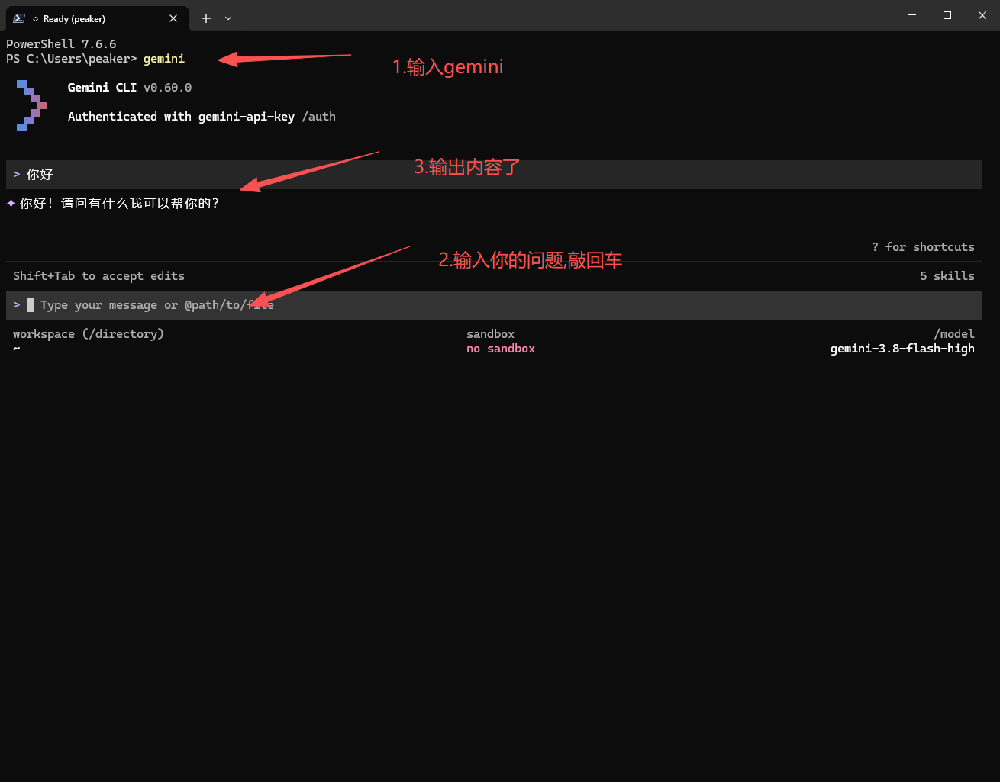

# Gemini CLI 接入教程

Gemini CLI 是在终端里运行的 Gemini 工具。本篇用 **Gemini API Key 模式**，填写本站地址和%%KEY_WORD%%接入；它不是 Gemini 网页，也不是 Google 官方账号登录，三者认证和额度分别管理。

**从哪里开始：** 第一次使用，从 [安装前准备](#prepare)开始。已经能运行 `gemini --version`，直接去 [配置本站](#site-config)。已经配置好，去 [第一次调用](#first-request)。不想手动配置，可先看 [星芒管理工具教程](/guide/manager)。

## 1. 安装前准备 {#prepare}

1. 按 [注册与准备](/guide/account)登录本站，确认额度和分组，并创建一个 [%%KEY_WORD%%](%%KEYS_URL%%)。
2. 在 [本站模型页](%%MODELS_URL%%)复制当前分组可用的 Gemini 模型 ID，后面要填进配置。
3. 按 [Node.js 与终端准备](/clients/nodejs)安装 Node.js。Gemini CLI 官方要求 Node.js 20.0.0 或以上。
4. 打开普通终端（Windows 用 PowerShell，Mac 用终端），逐行输入下面两条命令，确认都显示版本号。

```text
node -v
npm -v
```

**完成标志：** 有可用的%%KEY_WORD%%和模型 ID，两条版本命令都显示版本号。找不到命令或 PowerShell 报“禁止运行脚本”，回 [Node.js 与终端准备](/clients/nodejs#windows-errors)处理。

## 2. 安装 Gemini CLI {#install}

1. 在上一步的终端里运行官方 npm 安装命令，等待结束。

```text
npm install -g @google/gemini-cli
```

2. 安装结束后，运行下面的命令检查版本。

```text
gemini --version
```

Windows 若提示 `npm.ps1` 或 `gemini.ps1` 禁止运行，在同一个普通 PowerShell 中把命令开头的 `npm` 换成 `npm.cmd`，`gemini` 换成 `gemini.cmd`，不需要修改执行策略。macOS / Linux 出现 `EACCES` 时按 [Node.js 页的权限说明](/clients/nodejs#permissions)处理，不加 `sudo`。

**完成标志：** 能看到 Gemini CLI 的版本号。只有 Node.js 版本号不代表 Gemini CLI 已安装。继续 [配置本站](#site-config)。

## 3. 配置本站地址与%%KEY_WORD%% {#site-config}

需要两个文件，都放在用户配置目录 `.gemini` 里：Windows 为 `%USERPROFILE%\.gemini`，macOS / Linux 为 `~/.gemini`。设置过 `GEMINI_CLI_HOME` 时以实际位置为准。

### 打开配置目录

1. 先退出正在运行的 Gemini CLI。
2. 打开配置目录：Windows 按 Win+R，输入 `%USERPROFILE%\.gemini` 回车；Mac 在 Finder 按 Shift+Command+G，输入 `~/.gemini`。目录不存在时用下面命令创建。

**运行环境：Windows PowerShell。**

```powershell
New-Item -ItemType Directory -Force "$env:USERPROFILE\.gemini" | Out-Null
notepad "$env:USERPROFILE\.gemini\settings.json"
```

**运行环境：macOS / Linux 终端。**

```bash
mkdir -p ~/.gemini
touch ~/.gemini/settings.json ~/.gemini/.env
open -e ~/.gemini/settings.json
```

3. 目录里已有 `settings.json` 或 `.env` 时，先各复制一份备份，例如 `settings.before-xingmang.json`。

### 填写 settings.json

4. 在 `settings.json` 中选择 API Key 认证方式。新文件填入下面完整内容；已有文件只合并 `security.auth.selectedType`，保留其他设置。

```json
{
  "security": {
    "auth": {
      "selectedType": "gemini-api-key"
    }
  }
}
```

这份配置不强制启用 IDE 集成，也不改变执行权限。JSON 不支持注释，最后一个字段后不加逗号。

### 填写 .env

5. 打开同一目录下的 `.env`（Windows 可运行 `notepad "$env:USERPROFILE\.gemini\.env"`；Mac 运行 `open -e ~/.gemini/.env`），填入下面三行。
6. 把密钥和模型的占位文字替换成第 1 节准备的内容，保存后关闭编辑器。

```ini
GOOGLE_GEMINI_BASE_URL=%%BASE_URL%%
GEMINI_API_KEY=换成你创建的%%KEY_WORD%%
GEMINI_MODEL=替换为本站可用的模型ID
```

::: warning 先确认基址
`GOOGLE_GEMINI_BASE_URL` 只在 Gemini API Key 模式下生效，填 `%%BASE_URL%%`。普通 OpenAI 兼容地址（带 `/v1` 的那种）不能拿来冒充 Gemini。
:::

文件名必须是 `.env`，不能存成 `.env.txt`；Windows 记事本“另存为”时文件类型选“所有文件”。Gemini CLI 会优先读取当前目录及上级目录中找到的第一个 `.env`，项目里的 `.env` 或系统环境变量可能覆盖这里的设置。密钥文件不要放进项目、提交到公开仓库或发给别人。

**完成标志：** `settings.json` 和 `.env` 已保存，占位文字已替换，原文件已备份。保存失败或不知道如何合并时，按 [备份与恢复](/guide/recovery)检查。

## 4. 第一次调用与成功标志 {#first-request}

1. 新建一个空的练习文件夹，在终端进入它，再启动 Gemini CLI。

**运行环境：Windows PowerShell。**

```powershell
New-Item -ItemType Directory -Force "$env:USERPROFILE\gemini-practice" | Out-Null
Set-Location "$env:USERPROFILE\gemini-practice"
gemini
```

**运行环境：macOS / Linux 终端。**

```bash
mkdir -p ~/gemini-practice
cd ~/gemini-practice
gemini
```

2. 首次启动若询问认证方式，选择 **Use Gemini API key**，不要选 Google 账号登录。出现目录信任提示时，确认显示的是刚建的练习文件夹。



3. 在 Gemini CLI 的输入框（不是 PowerShell 或终端提示符）发送下面的文字。

```text
这是连接测试。请用一句话回复“连接测试完成”，不要读写文件或执行命令。
```

4. 收到完整回复后，打开 [本站控制台](%%CONSOLE_URL%%)的调用记录，核对时间、模型和状态。

配图用于辨认界面，版本、目录和模型以你本次实际显示为准。

**完成标志：** 文本有完整回复，本站能查到对应记录。详细判断见 [验证第一次调用](/guide/verify)。一条文本回复不证明图片或工具功能都可用，用到时再单独测试。

## 5. 失败时下一步 {#troubleshooting}

| 现象 | 下一步 |
| --- | --- |
| 找不到 `gemini` 或脚本被禁止 | 回 [第 2 节](#install)，重开终端，或改用 `gemini.cmd` |
| 又出现 Google 官方登录页 | 检查 `settings.json` 的 `selectedType` 是否为 `gemini-api-key`，启动时选 API Key |
| 读取到旧模型或旧密钥 | 检查系统环境变量、项目里的 `.env`，修改后重启 Gemini CLI |
| 配置文件报错 | 检查 JSON 逗号和括号，确认文件名没有多出 `.txt` |
| 路径错误或 404 | 核对 `GOOGLE_GEMINI_BASE_URL` 是否为 `%%BASE_URL%%`，不要换成 OpenAI 兼容地址 |
| 401 / 密钥无效 | 核对%%KEY_WORD%%是否完整、未禁用，分组是否允许该模型 |
| 有回复但本站无记录 | 检查是否仍在用官方登录，按 [验证页](/guide/verify)核对筛选条件 |

需要撤销时退出 Gemini CLI，把备份文件恢复到原位置。其他问题按 [排错顺序](/guide/troubleshooting)和 [备份与恢复](/guide/recovery)处理，或向 [客服](/contact)提供版本、时间和脱敏错误。截图前遮住%%KEY_WORD%%，不要把完整密钥发给任何人。

## 官方参考

核对日期：2026-10-04。参考 [Gemini CLI 安装说明](https://geminicli.com/docs/get-started/installation/)、[认证说明](https://geminicli.com/docs/get-started/authentication/)和 [配置参考](https://geminicli.com/docs/reference/configuration/)。菜单可能随版本变化，以当前版本界面为准，并按本篇的小请求验证本站渠道。
