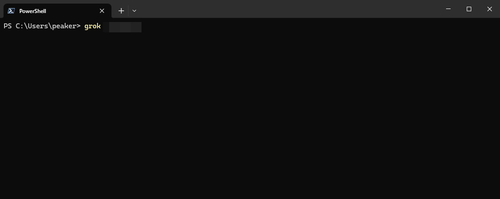
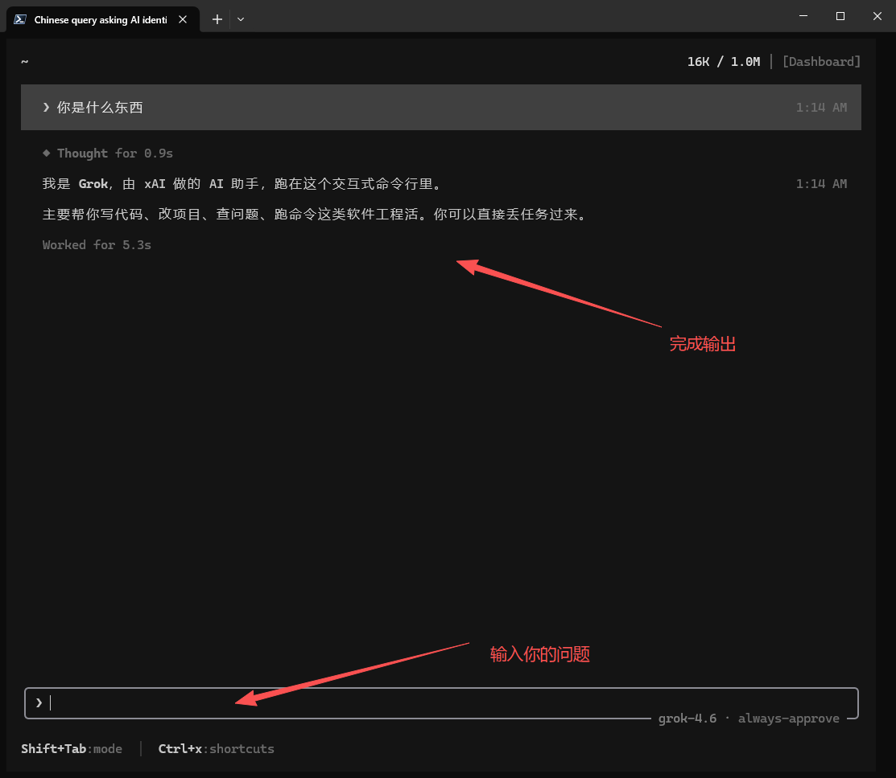

# Grok Build 接入说明

本页针对 xAI 官方 Grok Build，不把所有名为 Grok CLI 的社区项目混为同一个工具。已有不同来源的 CLI 时，先核对项目和版本。

::: tip 使用管理工具
不想手动配置可先看 [管理工具说明](/guide/manager)。
:::


## 1. 获取官方版本

从 [官方开始页面](https://docs.x.ai/build/overview)选择对应系统的安装方式。安装后使用该版本帮助页中的版本查看方法确认，不运行来源不明的同名安装脚本。

## 2. 查看配置作用域

官方用户配置位于 `~/.grok/config.toml`，Windows 对应 `%USERPROFILE%\.grok\config.toml`；设置 `GROK_HOME` 时以实际位置为准。项目配置和企业托管设置的作用不同，不把整份用户配置复制进项目。

可运行 `grok inspect` 检查实际读取的配置。输出可能包含敏感资料，分享前脱敏。

## 3. 配置本站提供方

先备份用户配置。以下为支持 Responses 的渠道示例，字段依据官方设置文档；本站是否支持相应功能需验证：

```toml
[models]
default = "xingmang"

[model.xingmang]
name = "星芒 AI"
model = "grok-4.6"
base_url = "%%BASE_URL%%/v1"
env_key = "XINGMANG_API_KEY"
api_backend = "responses"
```

已经存在 `[models]` 时合并，不重复建表。模型从 [本站列表](%%MODELS_URL%%)选择；如果渠道要求其他协议，先核对工具支持的 `api_backend` 与服务要求，不盲目修改。

`env_key` 填的是环境变量名，不是密钥本身。在启动 Grok 的同一个终端里设置密钥：

Windows PowerShell：

```powershell
$env:XINGMANG_API_KEY = "换成你创建的%%KEY_WORD%%"
```

macOS / Linux：

```bash
export XINGMANG_API_KEY="换成你创建的%%KEY_WORD%%"
```

以上设置仅对当前终端及其启动的程序生效；重新打开终端后需再次设置。


## 4. 验证并开始使用


```PowerShell
grok
```
cli终端




[排错顺序](/guide/troubleshooting) · [本站客服](/contact)

## 参考与验证状态

[官方设置](https://docs.x.ai/build/settings)。2026-09-08 核对字段；未实测本站渠道，未提供自制安装脚本。
