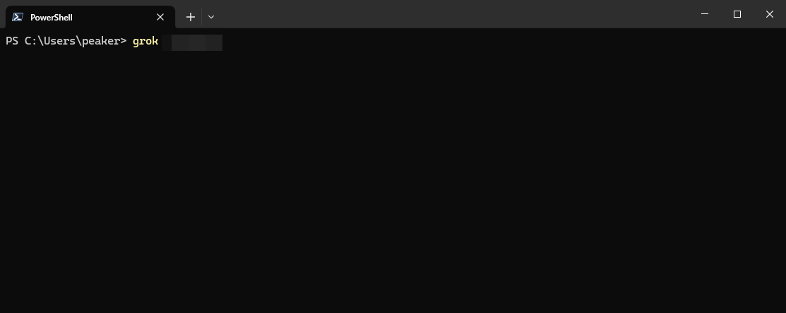
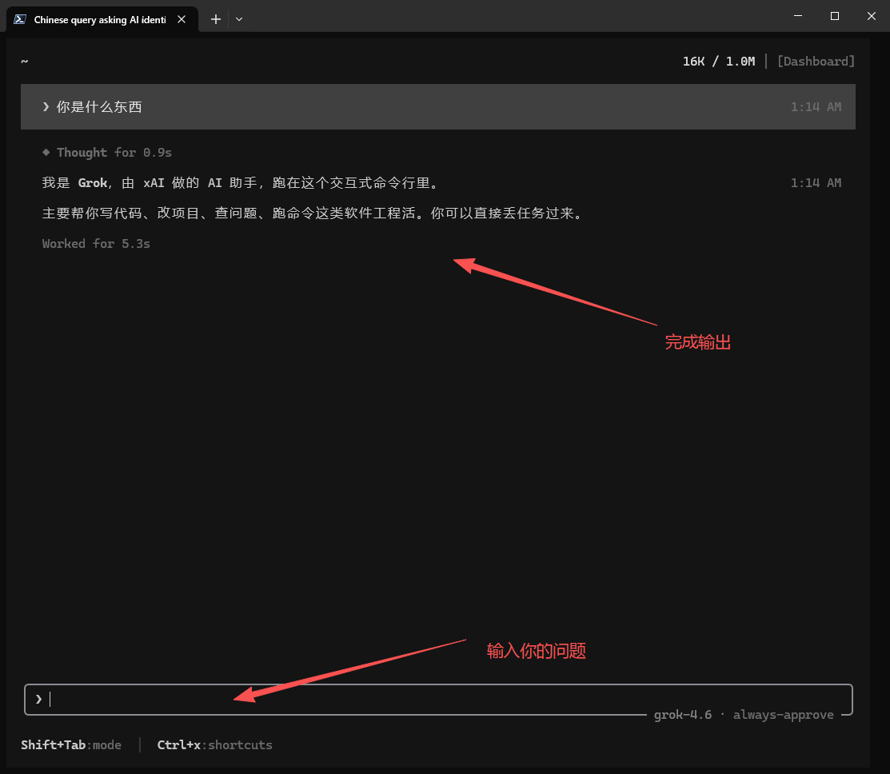

# Grok Build 接入说明

Grok Build 是 xAI 官方的终端编程工具，命令是 `grok`。本篇在它的配置里添加一个本站模型，用本站%%KEY_WORD%%调用；这不是 xAI 官方账号登录，也不包括其他同样叫 “Grok CLI” 的社区项目。

**从哪里开始：** 第一次使用，从 [安装前准备](#prepare)开始，再只做 [Windows](#windows) 或 [macOS / Linux](#mac) 中的一种安装。已经装好 Grok Build，直接去 [配置本站](#site-config)。不想手动配置，可先看 [星芒管理工具教程](/guide/manager)。

## 1. 安装前准备 {#prepare}

1. 按 [注册与准备](/guide/account)登录本站，确认额度和分组，并创建一个 [%%KEY_WORD%%](%%KEYS_URL%%)。
2. 在 [本站模型页](%%MODELS_URL%%)复制当前分组可用的模型 ID，后面要填进配置。
3. 如果电脑上已经有名为 `grok` 的命令，先确认它来自 xAI 官方，而不是同名社区项目。来源不清时，先不要在它上面继续配置。

**完成标志：** 有可用的%%KEY_WORD%%和模型 ID，知道自己要装的是 xAI 官方版本。

## 2. 安装 Grok Build {#install}

安装命令来自 [官方开始页面](https://docs.x.ai/build/overview)。执行前核对命令里的地址是 `x.ai`，不要运行来源不明的同名安装脚本。

### Windows {#windows}

1. 从开始菜单打开普通 **PowerShell**，不需要管理员身份。
2. 粘贴官方安装命令，按回车，等待安装结束。

```powershell
irm https://x.ai/cli/install.ps1 | iex
```

3. 关闭这个窗口，重新打开一个普通 PowerShell，再继续 [查看配置位置](#config-scope)。

### macOS / Linux / WSL {#mac}

1. 打开 **终端**。
2. 粘贴官方安装命令，按回车，等待安装结束。

```bash
curl -fsSL https://x.ai/cli/install.sh | bash
```

3. 关闭当前终端，重新打开一个新的终端窗口。

安装报错时保留报错文字，先核对网络和官方页面上的最新命令，不要关闭系统防护或改用管理员终端硬装。

**完成标志：** 在新终端里输入 `grok` 能识别这个命令（看到界面后可先按提示退出）。版本查看方式以当前版本帮助为准。继续下一节。

## 3. 配置本站地址与%%KEY_WORD%% {#site-config}

### 查看配置位置 {#config-scope}

用户配置文件位于 `~/.grok/config.toml`，Windows 对应 `%USERPROFILE%\.grok\config.toml`；设置过 `GROK_HOME` 时以实际位置为准。项目配置和企业托管设置作用不同，不要把整份用户配置复制进项目。

1. 先退出正在运行的 Grok Build。
2. 打开用户配置目录。已有 `config.toml` 时先复制一份备份，例如 `config.before-xingmang.toml`；没有就新建。

**运行环境：Windows PowerShell。**

```powershell
New-Item -ItemType Directory -Force "$env:USERPROFILE\.grok" | Out-Null
notepad "$env:USERPROFILE\.grok\config.toml"
```

**运行环境：macOS / Linux 终端。**

```bash
mkdir -p ~/.grok
touch ~/.grok/config.toml
open -e ~/.grok/config.toml
```

Linux 没有 `open -e` 时，用自己的文本编辑器打开该文件。

### 添加本站模型

3. 在 `config.toml` 中加入下面的内容，把模型占位文字换成第 1 节复制的模型 ID，保存。

```toml
[models]
default = "xingmang"

[model.xingmang]
name = "星芒 AI"
model = "替换为本站可用的模型ID"
base_url = "%%BASE_URL%%/v1"
env_key = "XINGMANG_API_KEY"
api_backend = "responses"
```

已经有 `[models]` 时只修改其中的 `default`，不要再建第二个 `[models]`。字段依据官方设置文档；`api_backend` 可选 `chat_completions`、`responses`、`messages`，本例使用 `responses`。本站渠道是否支持相应功能以实际验证为准，不要盲目改成其他值。保存时确认文件名没有变成 `config.toml.txt`。

### 在终端设置密钥

`env_key` 填的是环境变量的**名字**，不是密钥本身。密钥要在启动 Grok 的同一个终端里设置：

4. 在准备启动 Grok 的终端里，运行自己系统对应的一条命令，把占位文字换成你的%%KEY_WORD%%。

**运行环境：Windows PowerShell。**

```powershell
$env:XINGMANG_API_KEY = "换成你创建的%%KEY_WORD%%"
```

**运行环境：macOS / Linux 终端。**

```bash
export XINGMANG_API_KEY="换成你创建的%%KEY_WORD%%"
```

以上设置只对当前终端及其启动的程序生效；关闭终端后需要重新设置。不要把密钥直接写进 `config.toml` 或项目文件。

5. 在同一个终端运行 `grok inspect`，查看 Grok 实际读取了哪些配置和模型。

```text
grok inspect
```

输出可能包含敏感信息，分享或截图前先遮住。

**完成标志：** `config.toml` 已保存并备份，`grok inspect` 能看到本站模型配置，同一个终端已设置好密钥变量。继续 [第一次调用](#first-request)。

## 4. 第一次调用与成功标志 {#first-request}

1. 在设置了密钥的同一个终端里，新建并进入一个空的练习文件夹，再启动 Grok。

**运行环境：Windows PowerShell。**

```powershell
New-Item -ItemType Directory -Force "$env:USERPROFILE\grok-practice" | Out-Null
Set-Location "$env:USERPROFILE\grok-practice"
grok
```

**运行环境：macOS / Linux 终端。**

```bash
mkdir -p ~/grok-practice
cd ~/grok-practice
grok
```



2. 确认界面里选中的是刚添加的本站模型（显示名为“星芒 AI”）。如果要求浏览器登录 xAI 账号，先退出，回第 3 节检查配置和密钥变量，不要用官方账号登录代替本站配置。
3. 在 Grok 的输入框（不是 PowerShell 或终端提示符）发送下面的文字。

```text
这是连接测试。请用一句话回复“连接测试完成”，不要读写文件或执行命令。
```



4. 收到完整回复后，打开 [本站控制台](%%CONSOLE_URL%%)的调用记录，核对时间、模型和状态。

配图用于辨认界面，版本、目录和模型以你本次实际显示为准。

**完成标志：** 文本有完整回复，本站能查到对应记录。详细判断见 [验证第一次调用](/guide/verify)。

## 5. 失败时下一步 {#troubleshooting}

| 现象 | 下一步 |
| --- | --- |
| 找不到 `grok` | 重开终端；仍不行回 [第 2 节](#install)核对安装是否完成 |
| 要求浏览器登录 xAI | 用 `grok inspect` 检查是否读到本站模型和默认模型设置 |
| 提示缺少密钥 | 在启动 Grok 的同一个终端重新设置 `XINGMANG_API_KEY` |
| 配置文件报错 | 检查是否重复写了 `[models]`，文件名有没有多出 `.txt` |
| 401 / 密钥无效 | 核对%%KEY_WORD%%是否完整、未禁用，分组是否允许该模型 |
| 404 / 协议不兼容 | 核对 `base_url` 和 `api_backend`，保留脱敏错误，不随意尝试其他路径 |
| 有回复但本站无记录 | 检查是否仍在用官方账号或其他模型，按 [验证页](/guide/verify)核对 |

需要撤销时退出 Grok，把备份的 `config.toml` 恢复到原位置。其他问题按 [排错顺序](/guide/troubleshooting)和 [备份与恢复](/guide/recovery)处理，或向 [客服](/contact)提供版本、时间和脱敏错误。截图前遮住%%KEY_WORD%%，不要把完整密钥发给任何人。

## 官方参考

核对日期：2026-10-04。参考 [Grok Build 开始页面](https://docs.x.ai/build/overview)和 [Grok Build 设置](https://docs.x.ai/build/settings)。界面和命令可能随版本变化，以当前版本为准，并按本篇的小请求验证本站渠道。
