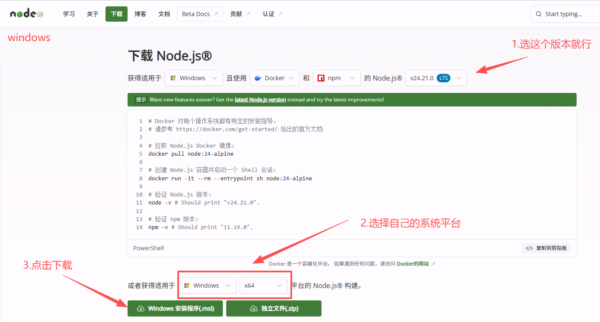
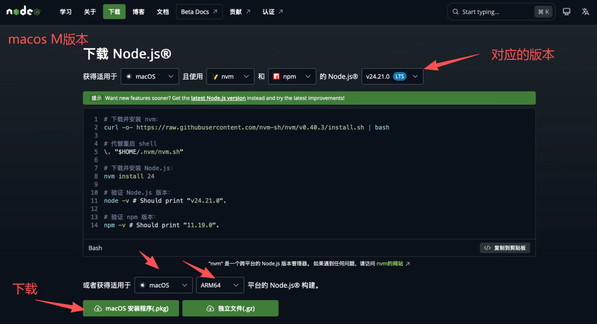
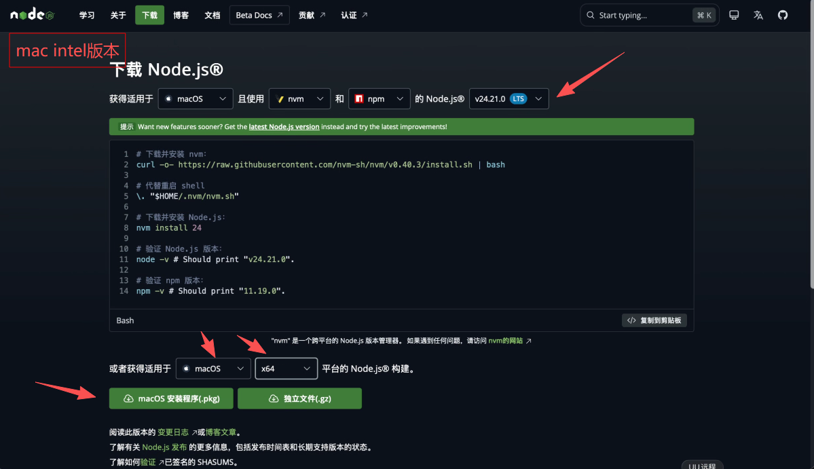
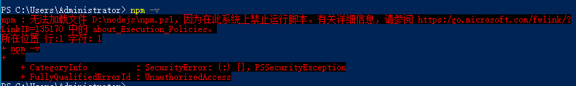

# Node.js 与终端准备

Node.js 是一些命令行工具（CLI）运行时需要的环境，npm 是它自带的安装命令。本页只负责把这两样准备好，**不会安装任何 AI 工具，也不会接入本站**。并非每个工具都要先装 Node.js：只有你选的安装方式用到 npm，或工具明确要求时才需要。

**从哪里开始：** 没装过 Node.js，从 [安装前准备](#prepare)开始，再只做 [Windows](#windows) 或 [macOS](#mac) 中的一种。已经装过，直接去 [检查版本](#check)。PowerShell 报“禁止运行脚本”，去 [Windows 脚本报错](#windows-errors)。

## 1. 安装前准备 {#prepare}

1. 打开你要安装的工具的教程，查看它要求的 Node.js 最低版本。例如 [Claude Code](/clients/claude-code) 的 npm 方式要求 22 或以上，[Gemini CLI](/clients/gemini-cli) 要求 20 或以上；以对应官方说明为准。
2. 确认自己的系统和芯片。Windows 打开“设置 → 系统 → 关于”，查看系统类型（x64 或 ARM64）；Mac 点左上角苹果菜单 →“关于本机”，查看是 Apple 芯片还是 Intel。
3. 如果电脑上已经在用 nvm 等版本管理器，继续用它安装和切换版本，不要再装一份覆盖系统环境。

**完成标志：** 知道目标工具要求的最低版本，以及自己的系统和芯片。Windows 继续 [下一节](#windows)；Mac 跳到 [macOS 安装](#mac)。

## 2. Windows 安装 {#windows}

1. 打开 [Node.js 下载页](https://nodejs.org/zh-cn/download)，选择 **LTS（长期支持版）**，核对系统为 Windows、架构与上一步一致。不要按旧截图里按钮的位置选择版本。



2. 下载完成后，打开“下载”文件夹，双击刚下载的 Node.js 安装程序。
3. 按提示点“下一步”，默认选项不用改，直到安装完成。
4. 关闭所有已经打开的 PowerShell 窗口，再从开始菜单打开一个新的普通 **PowerShell**。

**完成标志：** 安装程序显示完成，并已打开新的 PowerShell 窗口。接着去 [检查版本](#check)，不用执行 macOS 步骤。

## 3. macOS 安装 {#mac}

1. 打开 [Node.js 下载页](https://nodejs.org/zh-cn/download)，选择 **LTS** 版本，系统选 macOS，按芯片选择对应条目。

| Mac · Apple 芯片 | Mac · Intel 芯片 |
| --- | --- |
|  |  |

2. 下载完成后双击刚下载的 Node.js 安装包，按“继续”“安装”等实际提示操作。
3. 系统要求验证时，输入本机登录密码。这是电脑的安装授权，不是本站%%KEY_WORD%%。
4. 安装完成后，关闭旧的终端窗口，再打开一个新的 **终端**。

截图用于辨认系统和芯片选项，页面布局和版本号以官网当前显示为准。

**完成标志：** 安装器显示成功，并已打开新的终端窗口。接着去 [检查版本](#check)。

## 4. 检查版本 {#check}

1. 在新打开的终端（Windows 用普通 PowerShell，Mac 用终端）里输入下面两条命令，每输一条按一次回车。

```text
node -v
npm -v
```

2. 对照屏幕上的版本号：两条都显示版本数字，说明命令可用。
3. 把 Node.js 版本和目标工具要求的最低版本对比，低于要求时回到第 1 节安装新的 LTS 版本。

显示版本号只说明 Node.js 可用，**不代表 Codex、Claude Code 或 Gemini CLI 已经安装**，也还没有连接本站。找不到命令时，先确认已重开终端；WSL、远程服务器要在实际运行工具的那个环境里分别检查。

**完成标志：** 在将要运行 CLI 的同一个终端中，两条命令都显示版本号，且版本符合要求。PowerShell 报错时看 [下一节](#windows-errors)。

## 5. Windows 脚本报错 {#windows-errors}



如果报错明确写着 `npm.ps1` 无法加载、禁止运行脚本，按下面做：

1. 在同一个普通 PowerShell 中改用 `npm.cmd` 检查版本。

```powershell
npm.cmd -v
```

2. 能显示版本号后，后面教程里的 `npm install ...` 命令都把开头的 `npm` 换成 `npm.cmd` 执行。

`npm.cmd` 绕开的是 PowerShell 的脚本入口，不需要管理员终端，也不需要修改执行策略。不要把管理员运行、放宽整机执行策略或关闭安全防护当成解决办法。公司管理的电脑遵守管理员的规定。其他报错不要套用此方法，先看 [排错顺序](/guide/troubleshooting)。

**完成标志：** `npm.cmd -v` 显示版本号。回到你要安装的工具教程继续。

## 6. 权限与下载源 {#permissions}

macOS / Linux 全局安装时出现 `EACCES` 等权限错误，按 [npm 官方权限排错](https://docs.npmjs.com/resolving-eacces-permissions-errors-when-installing-packages-globally)改用版本管理器或用户级安装目录，**不要给 npm 安装命令加 `sudo`**。

想知道当前 npm 从哪里下载，可以查看：

```text
npm config get registry
```

没有特殊需求时使用官方源。不要为了一个工具改掉所有项目的下载来源；使用镜像前先确认它可信、同步及时。

## 7. 失败时下一步 {#troubleshooting}

| 现象 | 下一步 |
| --- | --- |
| 提示找不到 `node` 或 `npm` | 关闭并重开终端；仍不行就重新运行安装程序，确认安装完成 |
| PowerShell 提示 `npm.ps1` 禁止运行 | 按 [第 5 节](#windows-errors)改用 `npm.cmd` |
| 版本号低于工具要求 | 回 [第 1 节](#prepare)安装当前 LTS 版本，或用版本管理器切换 |
| macOS / Linux 出现 `EACCES` | 按 [第 6 节](#permissions)处理，不加 `sudo` |
| 下载很慢或中断 | 检查网络后重新下载，只从 Node.js 官网获取安装包 |

仍未解决时，记录系统版本、执行的命令和报错文字，按 [排错顺序](/guide/troubleshooting)检查，或联系 [客服](/contact)。截图里如有%%KEY_WORD%%或个人信息先遮住。

**下一步：** [安装 Codex CLI](/clients/codex#install-cli-command) · [安装 Claude Code](/clients/claude-code) · [安装 Gemini CLI](/clients/gemini-cli)

## 官方参考

核对日期：2026-10-04。参考 [Node.js 下载页](https://nodejs.org/zh-cn/download)、[npm 权限排错](https://docs.npmjs.com/resolving-eacces-permissions-errors-when-installing-packages-globally)和 [Gemini CLI 安装说明](https://geminicli.com/docs/get-started/installation/)。各工具的最低版本以其官方说明为准。
