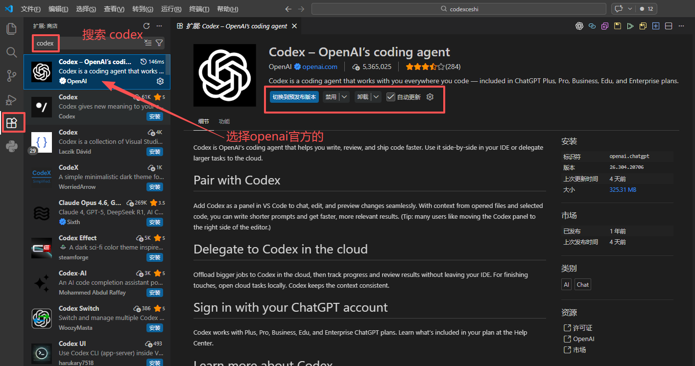
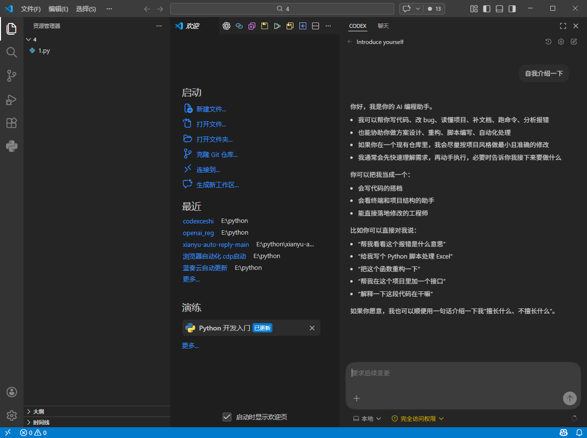

# VS Code 里怎么使用 AI 工具

VS Code 是微软出品的免费代码编辑器。它**本身不是**本站的客户端，装好 VS Code 不会自动接入本站。最稳妥的用法是：在 VS Code 的集成终端里运行已经接好本站的 Codex / Claude Code，或安装它们的官方扩展。

**从哪里开始：** 还没装 VS Code，从 [安装前准备](#prepare)开始。已经装好，直接去 [打开练习文件夹](#open-folder)，再选 [集成终端](#terminal-mode)或 [官方扩展](#extension-mode)。想了解 VS Code 自带聊天的 Key 设置，看 [自带聊天的边界](#builtin-chat)。

## 1. 先选你要的用法 {#choose-mode}

| 用法 | 适合谁 | 本站配置写在哪里 |
| --- | --- | --- |
| **A. 集成终端（推荐先做）**：在 VS Code 底部终端运行 `codex` 或 `claude` | 已在系统终端接通过 Codex / Claude Code | 沿用对应 CLI 教程写好的配置 |
| **B. 官方扩展**：Codex 扩展或 Claude Code 扩展的对话面板 | 想要图形界面，不想记命令 | 见下方 [扩展用法](#extension-mode)，配置位置因扩展而不同 |
| **C. VS Code 自带聊天**：编辑器内置的聊天与模型管理 | 了解即可，本站暂未验证 | 见 [自带聊天的边界](#builtin-chat) |

不同用法各自认证、各自计费。一种用法成功，不等于其他用法也走了本站。

**完成标志：** 已决定先走 A 或 B。第一次接入建议先走 A，成功后再试 B。

## 2. 安装前准备 {#prepare}

1. 按 [注册与准备](/guide/account)登录本站，确认账户有可用额度。
2. 在 [%%KEY_WORD%%页面](%%KEYS_URL%%)准备一个有效的%%KEY_WORD%%，在 [模型页面](%%MODELS_URL%%)记下当前分组可用的模型 ID。
3. 按对应教程装好并接通一个工具：[Codex](/clients/codex) 或 [Claude Code](/clients/claude-code)。在系统终端里能正常对话后再来 VS Code。
4. 新建一个空的练习文件夹，例如 `vscode-practice`。不要用含敏感资料的文件夹练习。

终端工具需要 Node.js 时，安装和检查方法见 [Node.js 与终端](/clients/nodejs)，本篇不重复。

**完成标志：** 本站有额度和%%KEY_WORD%%；至少一个工具已在系统终端调用成功；练习文件夹已建好。

## 3. 安装 VS Code {#install}

安装包只从 [VS Code 官方下载页](https://code.visualstudio.com/download)获取。

### Windows {#windows}

1. 打开 [VS Code 官方下载页](https://code.visualstudio.com/download)，选择 Windows 的 **User Installer**（用户安装版）。官方说明该版本不需要管理员权限。
2. 双击下载的 `VSCodeUserSetup-版本号.exe`，按提示完成安装。
3. 从“开始”菜单搜索 **Visual Studio Code** 并打开。

官方说明安装程序会把 VS Code 加入 PATH，之后可以在终端用 `code .` 打开当前文件夹；已打开的终端需要关掉重开才生效。

### macOS {#mac}

1. 打开 [VS Code 官方下载页](https://code.visualstudio.com/download)，下载 Mac 版本。
2. 打开下载的文件，把 **Visual Studio Code.app** 拖到 **Applications / 应用程序** 文件夹。
3. 从“应用程序”文件夹双击打开 VS Code；首次打开时按 macOS 的来源确认提示操作。
4. （可选）按 `Cmd+Shift+P` 打开命令面板，运行 **Shell Command: Install 'code' command in PATH**，然后重开终端。这样以后可以在终端用 `code .` 打开文件夹。

**完成标志：** VS Code 能独立打开。安装失败时回官方下载页核对系统和芯片版本，不要关闭系统安全保护来强行运行。

## 4. 打开练习文件夹 {#open-folder}

1. 在顶部菜单选择 **File（文件）→ Open Folder…（打开文件夹）**。
2. 选中第 2 节建好的练习文件夹，点击打开。
3. 如果弹出“是否信任此文件夹的作者”（Workspace Trust）提示，确认是自己的练习文件夹后再选择信任。
4. 看左侧资源管理器，确认显示的是练习文件夹名称。

**完成标志：** 左侧资源管理器显示练习文件夹。后面的终端和扩展都会以这个文件夹为默认工作位置。

## 5. 用法 A：在集成终端运行 {#terminal-mode}

集成终端就是 VS Code 窗口底部的命令行。它默认打开在资源管理器里显示的文件夹。

1. 在顶部菜单选择 **Terminal（终端）→ New Terminal（新建终端）**。也可以用快捷键：Windows 按 ``Ctrl+Shift+` ``，Mac 按 ``⌃⇧` ``。
2. 看终端提示符里的路径，确认是练习文件夹。
3. 检查工具能被找到：Codex 输入 `codex --version`，Claude Code 输入 `claude --version`。
4. 看到版本号后，输入 `codex` 或 `claude` 启动，等待进入它的对话输入区。
5. 出现工作目录或信任确认时，确认显示的是练习文件夹，再选择继续。

Windows 若提示 `codex.ps1` 被系统策略阻止，改用 `codex.cmd --version` 和 `codex.cmd` 启动，详见 [Codex 教程](/clients/codex#install-cli-command)。不要为此修改执行策略或改用管理员终端。

终端右上角的下拉菜单可以选择 PowerShell、zsh 等不同终端，默认跟随系统设置。如果系统终端能用而这里不能用，先确认两边是同一种终端。

**完成标志：** 在 VS Code 底部终端进入了 Codex 或 Claude Code 的对话输入区。接下来做 [第一次调用](#first-call)。

## 6. 用法 B：使用官方扩展 {#extension-mode}

扩展从 VS Code 的扩展视图安装：Windows 按 `Ctrl+Shift+X`，Mac 按 `Cmd+Shift+X`。安装前核对发布者，安装量高不能代替来源核验。

### Codex 扩展 {#codex-extension}

OpenAI 官方说明 Codex 扩展支持 VS Code、Cursor 等兼容编辑器。

1. 打开扩展视图，搜索 Codex，核对发布者是 OpenAI 后点击安装。



2. 点击侧栏中的 Codex 图标打开面板。找不到图标时，按 `Ctrl+Shift+P`（Mac 为 `Cmd+Shift+P`）打开命令面板，运行 **Codex: Open Codex Sidebar**。
3. 本站配置按 [Codex 教程的配置本站](/clients/codex#site-config)完成；扩展和 CLI 的启动方式见 [从 IDE 扩展启动](/clients/codex#ide-start)。
4. 完全退出 VS Code 再重新打开，在 Codex 面板中新建对话。

### Claude Code 扩展 {#claude-extension}

Anthropic 官方说明扩展需要 VS Code 1.94.0 或更高版本。扩展自带一份对话面板用的 CLI，但**不会**把 `claude` 命令加入终端；想在集成终端里输入 `claude`，仍需按 [Claude Code 教程](/clients/claude-code)单独安装。

1. 打开扩展视图，搜索 **Claude Code**，核对发布者是 Anthropic 后点击安装。
2. 安装后若没有出现，按 `Ctrl+Shift+P`（Mac 为 `Cmd+Shift+P`）运行 **Developer: Reload Window**。
3. 打开任意文件，点击编辑器右上角的 Spark 图标打开 Claude 面板；也可以点左侧活动栏的 Spark 图标。
4. 首次打开会出现登录界面，这是 Anthropic 官方账号登录，**不要把本站%%KEY_WORD%%填进去**。

官方说明扩展和 CLI 共用 `~/.claude/settings.json`。按 [Claude Code 教程](/clients/claude-code#manual-config)写好本站配置后，扩展是否跳过官方登录、能否读到这份配置，以当前版本实际表现为准；本站暂未把扩展列为已验证入口。第一次接入请先用 [集成终端](#terminal-mode)。官方提示：如果环境变量在终端里设置、扩展却读不到，可以从终端用 `code .` 启动 VS Code。

**完成标志：** 扩展面板能打开，并进入对话输入区。扩展仍要求官方登录或报认证错误时，回到 [用法 A](#terminal-mode)，不要用官方登录代替本站配置。

## 7. VS Code 自带聊天的边界 {#builtin-chat}

VS Code 官方文档说明，自带聊天可以通过 **Chat: Manage Language Models** 添加自己的模型 Key，其中有一项 **Custom Endpoint**（自定义端点），支持 Chat Completions、Responses、Messages 三种接口。官方同时说明：这类自带 Key 只用于聊天和辅助任务，行内补全、语义搜索等仍需要 GitHub 账号。

本站**尚未验证** VS Code 自带聊天的自定义端点能否稳定使用本站服务，地址写法也未核对。初学者请优先用 A 或 B。确实要尝试时：

- 先联系 [客服](/contact)确认协议与地址写法，不要随意尝试路径。
- 只在练习文件夹中试，按 [第一次调用](#first-call)核对本站记录。
- 官方提示：模型要在聊天的 Agent 中使用，必须支持工具调用。

**完成标志：** 明白自带聊天和本站接入是两件事；没有确认前不把它当作本站入口。

## 8. 第一次调用与成功标志 {#first-call}

1. 在终端里的 Codex / Claude Code，或扩展的对话面板中，发送下面的文字。注意是发给工具的对话框，不是工具启动前的终端命令行。

```text
这是连接测试。请用一句话回复“连接测试完成”。
不要联网，不读写文件，不执行其他工具。
```

2. 等待出现完整回复。
3. 打开 [本站控制台](%%CONSOLE_URL%%)，进入调用或用量记录，核对刚才的时间、模型和状态。
4. 终端和扩展要分别做一次测试，一个成功不代表另一个也走了本站。



配图用于辨认入口，模型和界面以你本次实际显示为准。截图时遮住%%KEY_WORD%%、账号和私人路径，不要把完整密钥发到聊天或客服。

**完成标志：** 有完整回复，本站有对应记录，详细判断见 [验证第一次调用](/guide/verify)。然后按 [文件夹练习](/learn/working-with-files)先只读理解，再限定一次写入。

## 9. 失败时下一步 {#troubleshooting}

| 现象 | 下一步 |
| --- | --- |
| 集成终端找不到 `codex` 或 `claude` | 先在系统终端检查同一命令；刚装好时完全退出 VS Code 再打开。系统终端也找不到，回对应教程 |
| 装了 Claude Code 扩展，终端仍找不到 `claude` | 正常现象，扩展不提供终端命令；按 [Claude Code 教程](/clients/claude-code)单独安装 |
| 工具或扩展要求登录官方账号 | 没有读到本站配置。回 [Codex](/clients/codex#site-config) 或 [Claude Code](/clients/claude-code#manual-config)核对配置，不用官方登录代替 |
| 刚改了配置或环境变量不生效 | 保存后完全退出 VS Code 再打开；扩展读不到终端里的变量时，从终端用 `code .` 启动 |
| 模型不存在或无权限 | 回 [模型页面](%%MODELS_URL%%)核对当前分组可用的模型 ID |
| 有回复，但本站没有记录 | 确认用的是哪个入口：自带聊天、官方登录都不走本站 |
| 连接了 WSL、容器或远程服务器 | 命令实际在远程环境里运行，安装和配置也要在那个环境里另做一遍，见 [远程开发说明](https://code.visualstudio.com/docs/remote/remote-overview) |

Cursor 另有 [专门说明](/clients/cursor)，它的内置能力不能简单当作 VS Code 加一个插件。仍未解决时按 [排错顺序](/guide/troubleshooting)整理 VS Code 版本、工具或扩展版本、时间和脱敏错误，再联系 [客服](/contact)。

## 官方参考

核对日期：2026-10-04。

- [VS Code 入门（安装、打开文件夹、扩展）](https://code.visualstudio.com/docs/getstarted/overview)
- [Windows 安装](https://code.visualstudio.com/docs/setup/windows) · [macOS 安装](https://code.visualstudio.com/docs/setup/mac)
- [VS Code 集成终端](https://code.visualstudio.com/docs/terminal/basics)
- [VS Code 远程开发](https://code.visualstudio.com/docs/remote/remote-overview)
- [VS Code 聊天的语言模型与自带 Key](https://code.visualstudio.com/docs/copilot/customization/language-models)
- [Codex IDE 扩展](https://developers.openai.com/codex/ide)
- [Claude Code VS Code 扩展](https://code.claude.com/docs/en/vs-code)

菜单和图标可能随版本变化，以当前版本界面为准。本页未声称所有第三方扩展均已通过本站接入测试。
